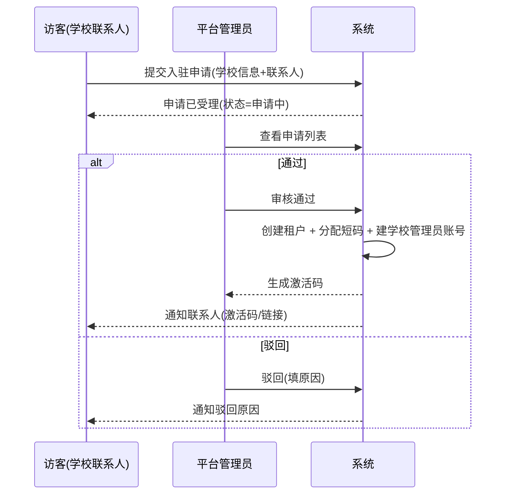
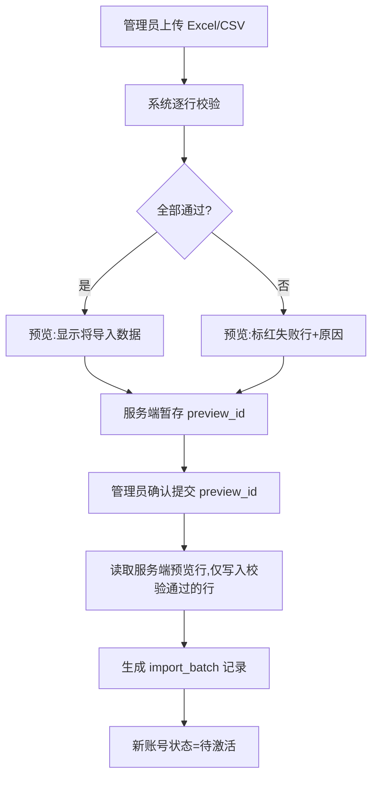
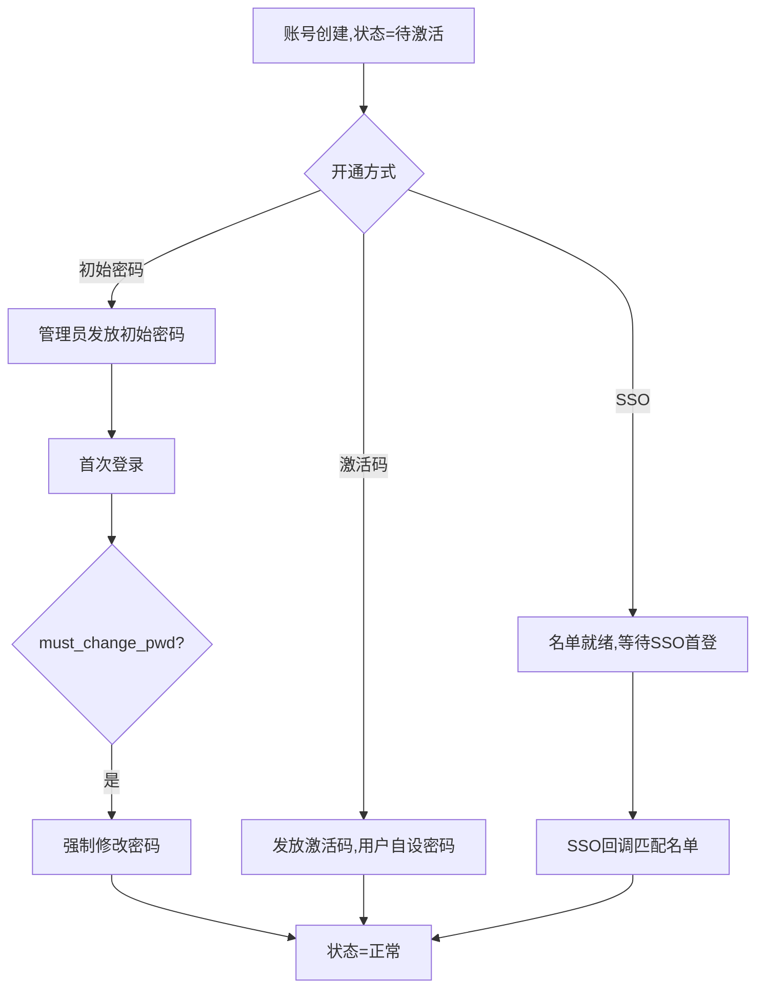
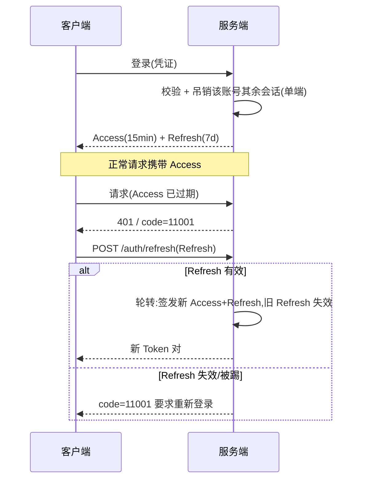
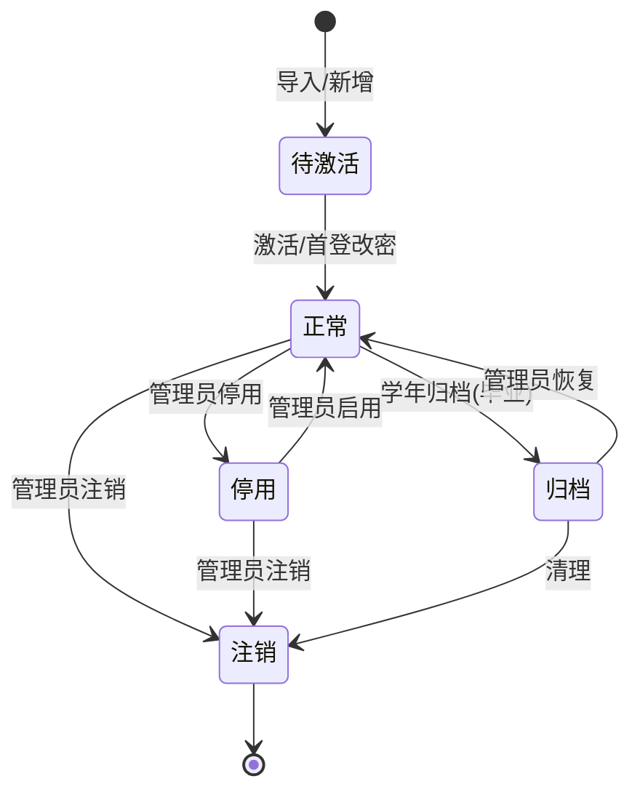
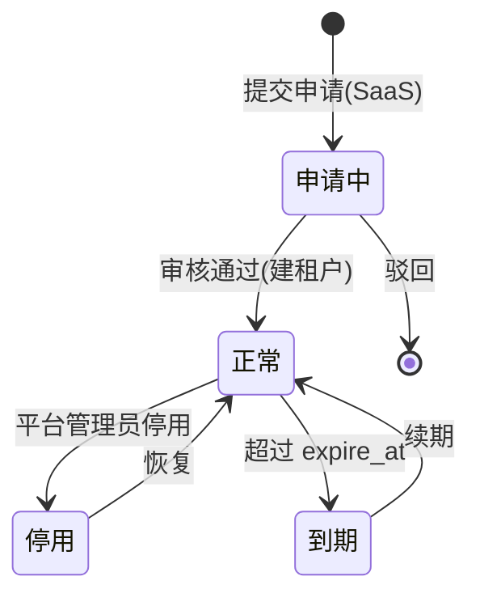
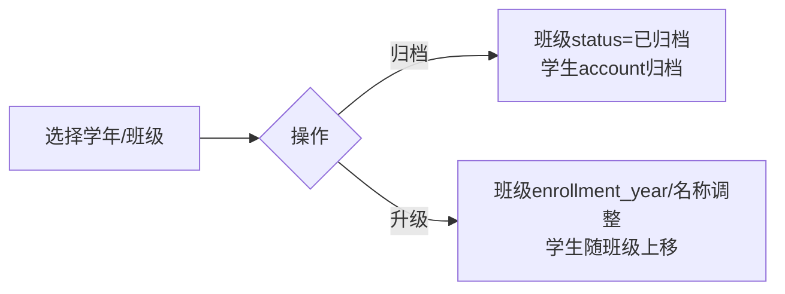

# M1 身份与租户 — 业务流程与状态机

> 用 Mermaid 描述关键流程与状态流转。
> 最后更新:2026-05-29

---

## 1. 学校入驻流程(SaaS)

私有化部署:无此流程,初始化脚本或 `chaimir/migrate migrate-and-seed` 直接创建租户与顶层学校管理员。
脚本只做编排,实际建租户、建账号、授予教师/学校管理员角色和写审计均调用 M1 bootstrap 服务,
不在 shell 或原始 SQL 中复制账号开通规则。

首个学校管理员说明:此时学校真实院系/专业/班级尚未录入,系统只创建账号与教师、学校管理员角色,
不自动创建任何默认院系,也不写入虚假的组织档案。该管理员登录后先维护真实组织架构,再补齐自己的
工号、院系、职称等 `account_profile` 信息;后续创建/导入师生必须挂靠真实组织。

---

## 2. 账号导入流程(两步:预览 + 提交)

校验项:必填项、手机号格式、学号/工号租户内去重、班级/院系存在性。预览结果写入 `import_preview`,
提交只传 `preview_id`,不得由前端回传 rows 作为权威数据。

---

## 3. 账号开通与首次登录

SSO 首登细则:
- CAS 走浏览器跳转:服务端生成登录地址,回调时校验 `ticket` 与 `service`,取得学校身份标识后只匹配已导入账号。
- LDAP 走账号密码直连:服务端使用学校 LDAP 服务绑定并查询用户条目,取得 `match_attribute` 后只匹配已导入账号。
- SSO 不负责自动建账号或补组织档案;未导入名单返回"账号未在名单中",由学校管理员先完成导入/维护。

---

## 4. 登录与双 Token 无感刷新(单端)

---

## 5. 账号状态机

- 归档:数据保留,不可登录,可恢复(毕业生)。
- 注销:终态,不可登录;数据按合规保留,不物理删除(软删 `deleted_at`)。

---

## 6. 租户状态机

- 停用/到期:全校无法登录;私有化部署无此状态流转(恒正常)。

---

## 7. 班级归档与升级

归档与升级为批量操作,全程记审计日志。
