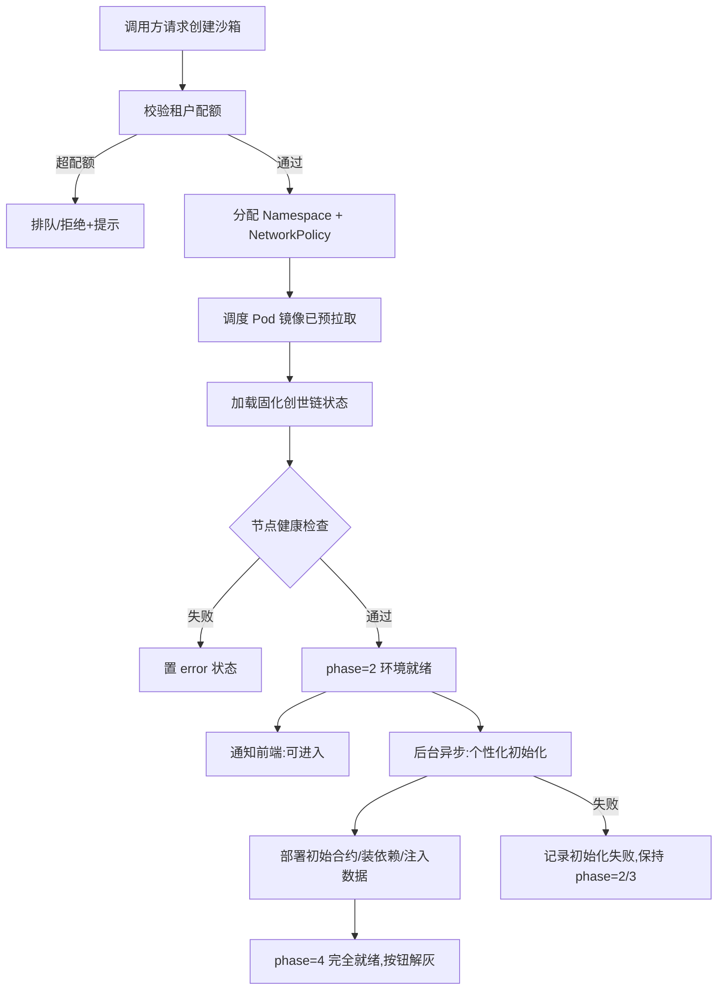
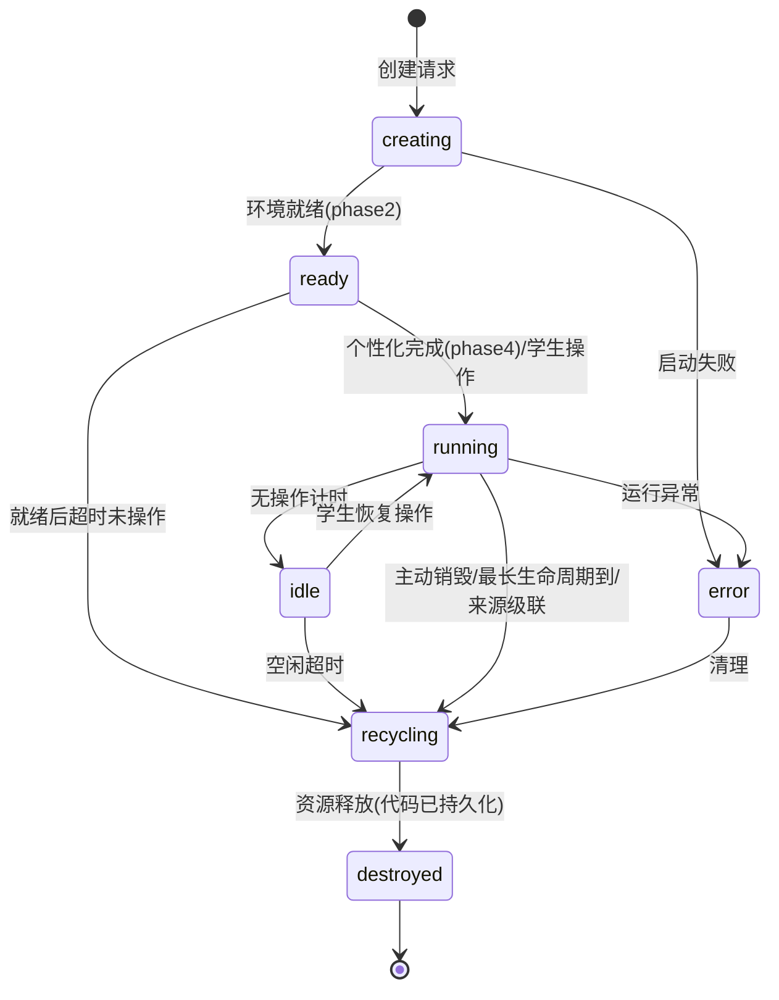
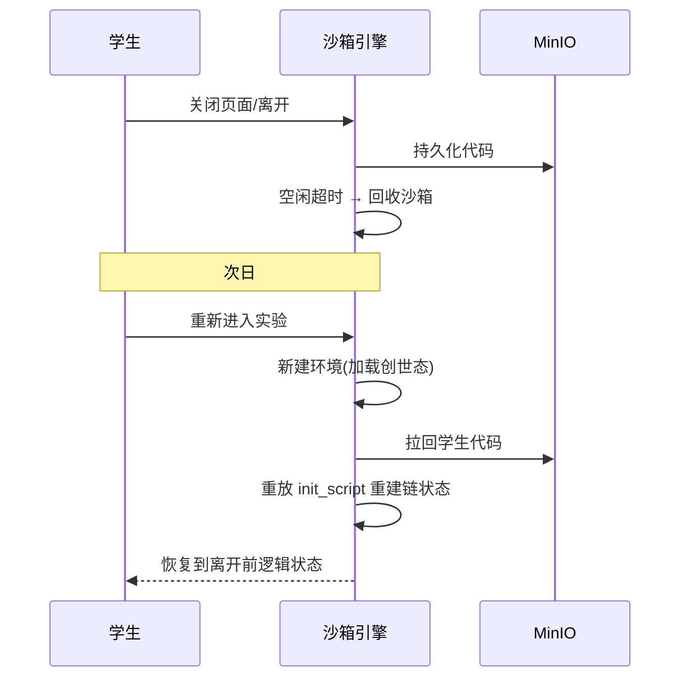
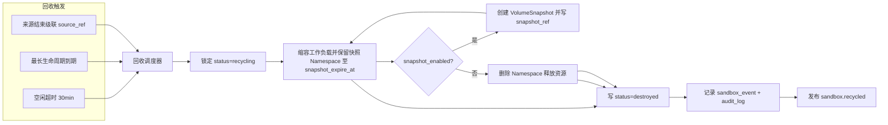
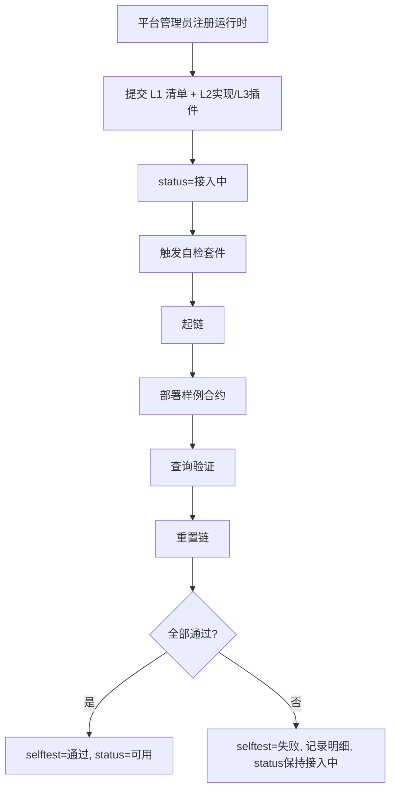
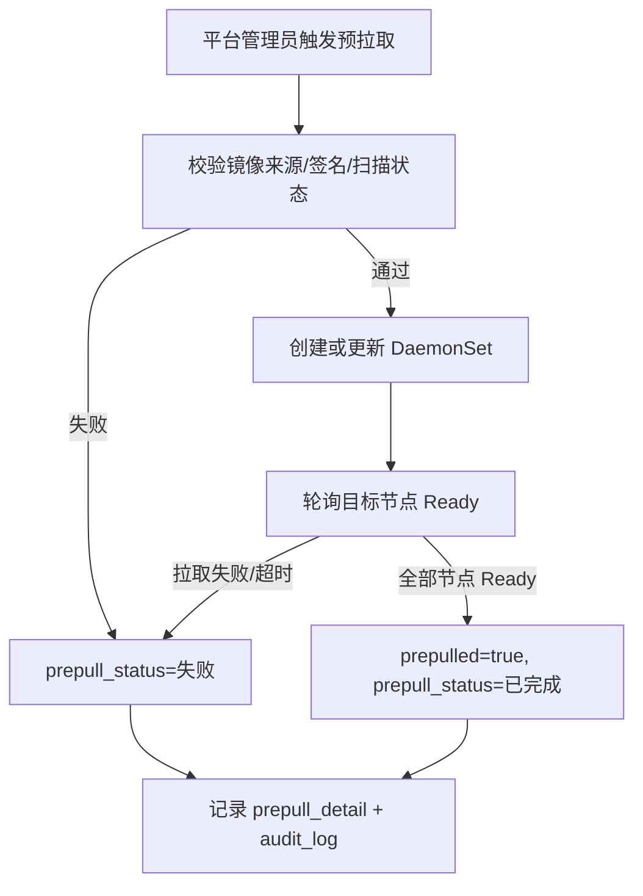
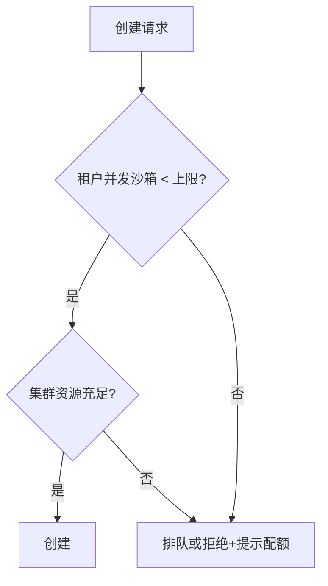

# M2 沙箱引擎 — 业务流程与状态机

> 用 Mermaid 描述沙箱启动、生命周期、回收、适配器接入流程。
> 最后更新:2026-06-04

---

## 1. 分阶段启动流程

阶段一(A→G,目标 ≤5s)完成即让学生进入;阶段二(I→K)后台补齐。
阶段一任一步失败必须进入 `error` 并触发回收;阶段二失败不得伪装成完全就绪,只能保留可进入状态并禁用依赖个性化初始化的能力。

---

## 2. 沙箱状态机

- **ready 态超时回收**(B6 修复):就绪后长时间未操作(如 10min)直接回收,防止就绪沙箱僵尸占用。
- **回收事件通知来源**(A4 修复):沙箱进入 `recycling`(任何触发:空闲/最长生命周期/就绪超时)时,**发布 `sandbox.recycled` 事件**(经事件总线,按 `source_ref` 标识),来源方(experiment/contest)订阅后同步更新自身实例状态,避免上游仍持 `sandbox_ref` 而沙箱已销毁的悬挂。上游恢复(resume)前应探活,已销毁则触发重建(代码已持久化 + 重放部署脚本)。用事件而非反向接口调用,避免 sandbox 反向依赖业务层(见工程目录设计 §3.1.1)。

- 进入 `recycling` 前确保学生代码已持久化到 MinIO。
- `keep_alive=true` 的沙箱:`idle` 不触发空闲回收,但仍受 `keep_alive_until`、`expire_at`、租户并发与资源配额约束。

---

## 3. 断点续做(默认重建)

---

## 4. 回收流程(三重保证)

回收失败处理:
- 持久化失败:保留 Namespace,写 `error`,等待重试或人工处理。
- 快照成功:由于 CSI `VolumeSnapshot` 是 namespaced 资源,不得立即删除所在 Namespace;必须先缩容/删除计算工作负载释放 CPU/内存,保留 PVC/VolumeSnapshot/Namespace 至 `snapshot_expire_at`,由过期清理任务删除。
- 快照失败:若调用方要求保留运行态,保留 Namespace 并写 `error`;若只是普通回收且未要求快照,按默认重建策略继续删除。
- K8s 删除失败:保持 `recycling`,由调度器重试,不得写 `destroyed`。

---

## 5. 运行时接入即测流程

只有自检全绿的运行时才对调用方可用,杜绝"宣称支持但未验证"。

## 6. 镜像预拉取流程

预拉取完成以 Kubernetes 节点实际 Ready 状态为准,不能以接口调用成功或 DB 更新作为成功。

---

## 7. 配额与排队

