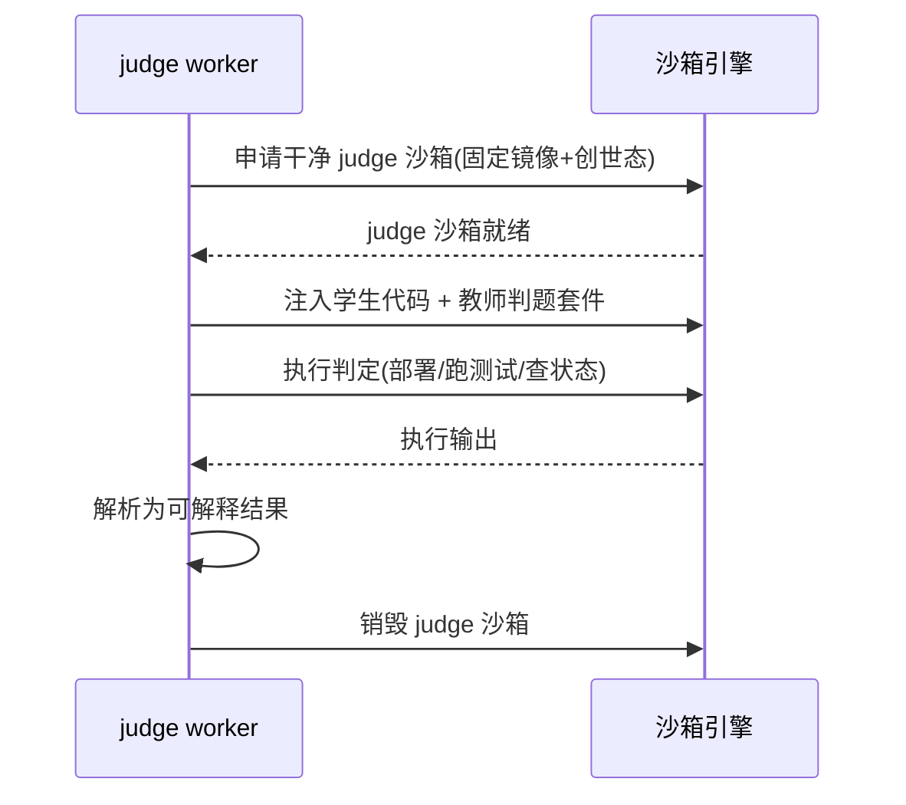

# M3 评测引擎 — 架构设计

> 核心:判题器插件框架、judge 专用沙箱、异步判题队列、确定性与可解释结果。
> 最后更新:2026-06-08

---

## 1. 总体架构

```
┌──────────────────────────────────────────────────┐
│  调用方:M7 实验 / M8 竞赛 / M6 作业                  │
│  提交(内容 + 判题配置 + 来源标识)                    │
└─────────────────────┬────────────────────────────┘
                      │ POST /judge
┌─────────────────────▼────────────────────────────┐
│  M3 评测引擎(Go)                                   │
│  ┌─────────┬──────────┬──────────┬─────────────┐ │
│  │ 提交接收 │ 判题队列  │ 判题器    │ 结果回写     │ │
│  │ +限频   │(优先级)  │ 调度器    │ +可解释      │ │
│  └────┬────┴────┬─────┴────┬─────┴─────────────┘ │
└───────┼─────────┼──────────┼───────────────────────┘
        │         │          │ 申请 judge 沙箱
        │         │   ┌──────▼──────────────────────┐
        │         │   │ M2 沙箱引擎(干净判题沙箱)     │
        │         │   │ 注入:学生代码 + 判题套件      │
        │         │   │ 跑判定 → 产出结果 → 立即销毁   │
        │         │   └─────────────────────────────┘
        │    ┌────▼─────┐
        │    │ judge    │ ← 横向扩展的判题 worker
        │    │ worker x N│
        │    └──────────┘
```

---

## 2. 判题器插件框架

### 2.1 统一判题器接口

每个判题器实现统一契约:

| 方法 | 说明 |
| --- | --- |
| `Prepare(submission, config)` | 准备判题输入(代码、套件、期望) |
| `Judge(sandbox)` | 在 judge 沙箱内执行判定 |
| `Report() → Result` | 产出分数 + 通过与否 + 可解释详情 |

### 2.2 六类判题器

| 判题器 | 执行方式 | 是否起链沙箱 |
| --- | --- | --- |
| J1 测试用例 | 沙箱内跑测试套件,解析通过数 | 是 |
| J2 链上断言 | 部署合约→执行断言→比对链上状态 | 是 |
| J3 Flag | 比对静态/HMAC/链上 flag | 部分 |
| J4 静态检查 | gas/SWC/规范扫描 | 否(纯静态) |
| J5 仿真检查点 | 调 M4 校验操作目标 | 否(依赖 M4) |
| J6 人工评分 | 教师录入,不自动执行 | 否 |

新判法 = 实现接口 + 注册一个判题器,平台代码不改。

---

## 3. judge 专用沙箱(安全核心)



- judge 沙箱与学生交互沙箱**完全不同的实例**,学生无任何途径访问。
- 判题套件、测试用例、正确答案只存在于 judge 沙箱,跑完即毁,对学生黑盒。
- 用后即毁保证环境干净,无残留影响下次判题。

---

## 4. 确定性与可复现

- 固定 judge 沙箱镜像版本 + 固定创世状态;运行型判题器必须在 `judger.resource_spec` 中声明 `runtime_image_version` 与 `genesis_ref`,M3 创建 fresh judge 沙箱时把 `runtime_image_version` 传给 M2,由 M2 按版本选择镜像,不得使用运行时当前默认镜像替代。
- 判题逻辑禁止依赖:随机数、真实时间、外部网络。
- 每次判题记录**输入快照**:`学生代码 hash + 判题套件版本 + runtime_image_version + genesis_ref + 判题器版本`。
- 重判:按快照原样重跑,结果必一致(申诉、判题器修复后回溯)。

---

## 5. 异步判题队列

```
提交 → 限频校验 → 入队(优先级)→ worker 消费 → judge 沙箱判定 → 回写结果 → 通知调用方
```

- **优先级**:竞赛提交 > 实验提交 > 作业提交(可配)。
- **超时**:单次判题超时则终止并标记超时。
- **重试**:系统性失败(沙箱申请失败等)按策略重试;判定失败(代码错误)不重试,直接出结果。
- **扩展**:judge worker 无状态,按队列积压横向扩缩容。
- **终态事件可靠发布**:`judge.completed`/`judge.failed` 先写入 M3 自有 `judge_event_outbox`,再由 worker 按 `JUDGE_WORKER_BATCH_SIZE` 批量发布并标记 published。发布失败保留 failed/pending outbox 供下一轮重试,不重新执行已完成的判题任务。

---

## 6. 可解释结果

结果结构不只含分数,还含逐项详情:

```json
{
  "passed": false,
  "score": 60,
  "max_score": 100,
  "details": [
    { "case": "转账后余额正确", "passed": true },
    { "case": "超额转账应 revert", "passed": false,
      "expected_label": "应拒绝超额转账", "actual": "转账成功", "hint": "缺少余额校验" }
  ],
  "snapshot_ref": "judge:2026:sub:8801"
}
```

服务教学(学生知道错在哪)+ 申诉(有据可查)。

---

## 7. 多租户

- 判题任务带 `tenant_id`;judge 沙箱经 M2 按租户隔离。
- 判题器定义为平台级配置;判题任务/结果为租户级数据(RLS)。

## 8. 跨模块依赖口径

- M3 只通过 `internal/contracts.SandboxService` 调 M2 创建/回收 judge 沙箱、注入代码/套件、执行受限判题命令和调用链上能力,禁止 import `internal/modules/sandbox`。
- M3 调 M2 执行命令仅限 judge worker 内部使用:命令来自平台级 `judger.resource_spec.command`,运行型判题器同时固定 `runtime_code`、`runtime_image_version`、`genesis_ref`、`command` 和重试/超时策略;工作目录为沙箱工作区,必须带超时,stdout/stderr 只用于解析判题结果和写日志,不得向学生暴露完整测试套件输出。
- M3 worker 与查重能力的通用运行边界必须来自统一环境配置:`JUDGE_RESULT_DETAILS_MAX_BYTES` 限制 `details` JSON 最大字节数,`JUDGE_INPUT_INJECT_TIMEOUT_SECONDS` 限制代码/套件注入与解包命令超时,`JUDGE_INPUT_ARCHIVE_MAX_FILES` 与 `JUDGE_INPUT_ARCHIVE_MAX_UNPACKED_BYTES` 限制学生提交/判题套件归档的文件数和展开大小,`JUDGE_SIMILARITY_DEFAULT_THRESHOLD` 控制查重相似度默认命中阈值;不得在 worker 或 service 内硬编码阈值。
- M3 注入学生提交和判题套件前必须在后端校验并重打归档,拒绝绝对路径、`..`、Windows 盘符、重复条目、软/硬链接和特殊文件。不得把对象存储中的 tar/zip 直接交给 judge 沙箱内 `tar` 解包,防止学生提交覆盖套件目录或逃逸工作区。
- M3 只通过 `internal/contracts.ContentJudgeService` 调 M5 读取题目锁定版本的判题配置、答案、flag 与套件引用;M3 不保存题目正本,调用方也不得把答案经 HTTP 传给 M3。
- J5 仿真检查点由 M7/M4 在上层编排产生检查点输入快照后提交 M3;M3 不直接依赖 M4,避免同层引擎互相调用。
- 判题完成发布 `judge.completed`;系统性失败重试耗尽发布 `judge.failed`;调用方订阅事件处理业务状态,避免 M3 反向调用 M6/M7/M8。
