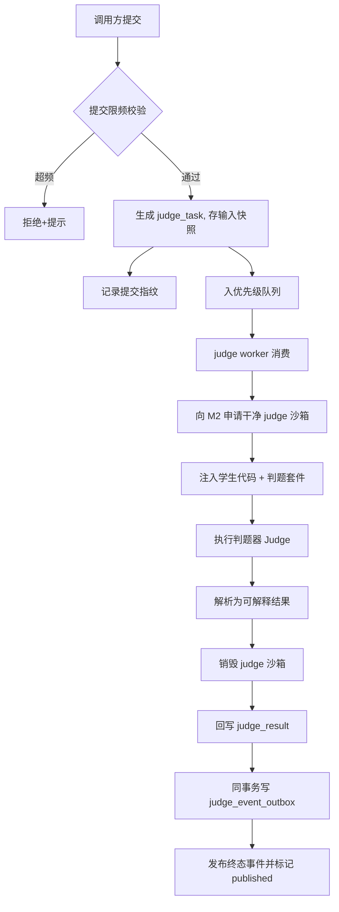
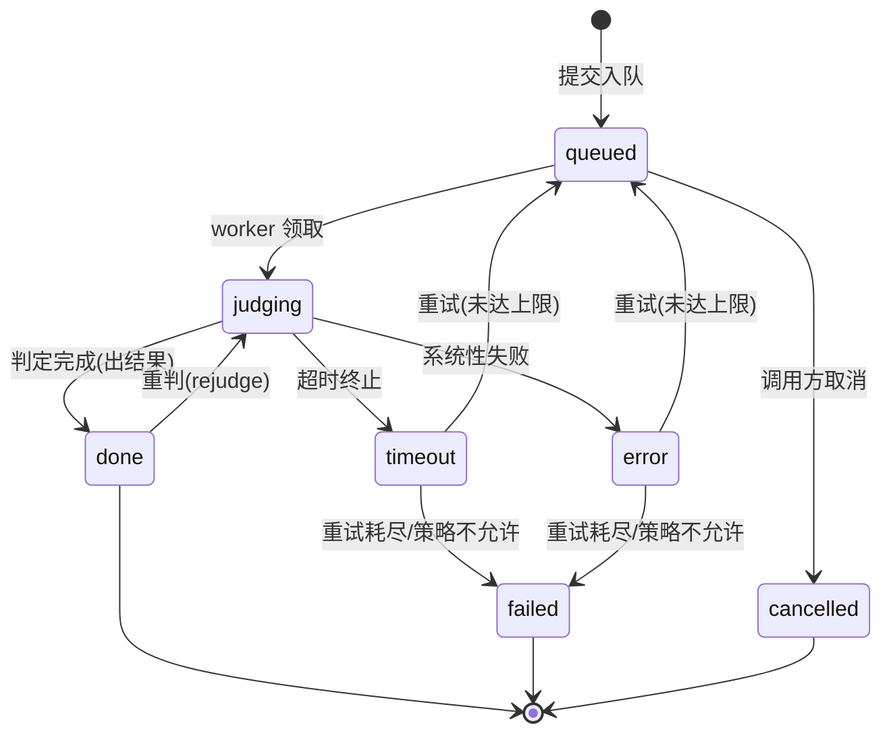
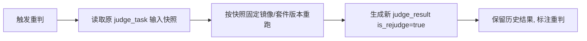
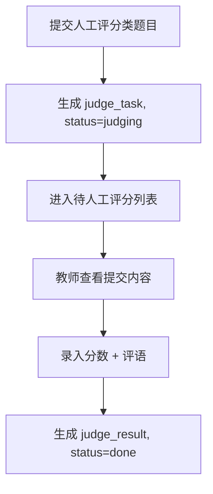
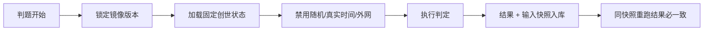

# M3 评测引擎 — 业务流程与状态机

> Mermaid 描述判题流程、任务状态机、重判与人工评分流程。
> 最后更新:2026-06-08

---

## 1. 异步判题流程

---

## 2. 判题任务状态机

- `done` 含通过与不通过,均为正常终态(代码错误不是 error)。
- `error`/`timeout` 指系统性问题(沙箱申请失败、判题器异常),按策略重试。
- **`failed` 为失败终态**:重试达上限或策略不允许重试时进入。进入 failed 时与状态更新同事务写入 `judge_event_outbox`,随后发布 `judge.failed` 事件(携带 task_id/source_ref/失败原因);调用方(teaching/experiment/contest)订阅后进入各自异常分支(如提交标记"判题失败可重试"、实例检查点标记异常),不再无限等待。用事件而非反向接口调用,避免 judge 反向依赖业务层(见工程目录设计 §3.1.1)。事件发布失败不得回滚已完成/已失败的判题终态,只能保留 outbox 待重试。
- `judge_task.status` 枚举相应增加 `failed`。

---

## 3. 重判流程(申诉/题目修复)

- 单条重判:申诉场景。
- 批量重判:题目/判题器修复后,按 `source_ref` 全量回溯。

---

## 4. 人工评分流程(J6)

人工评分不进 judge 沙箱、不自动执行,由教师产出结果。

---

## 5. 确定性保障流程

