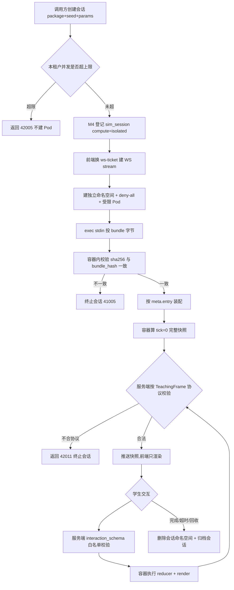
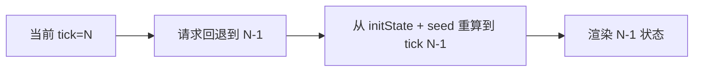
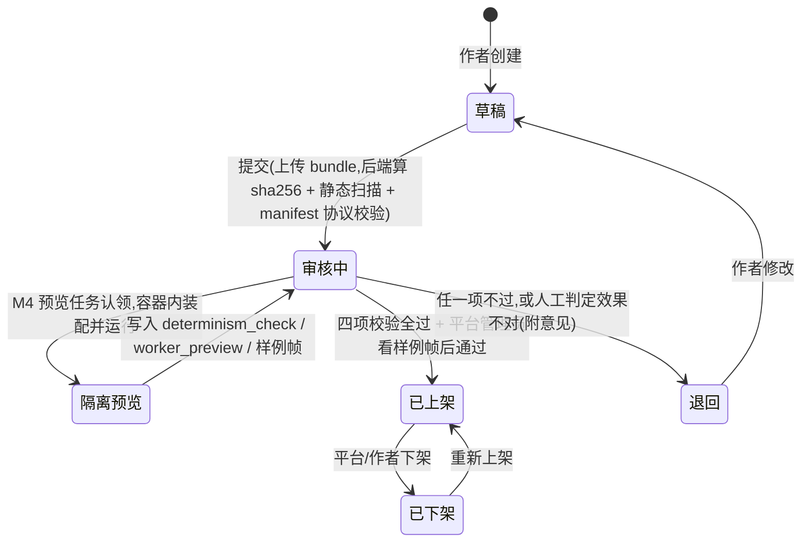
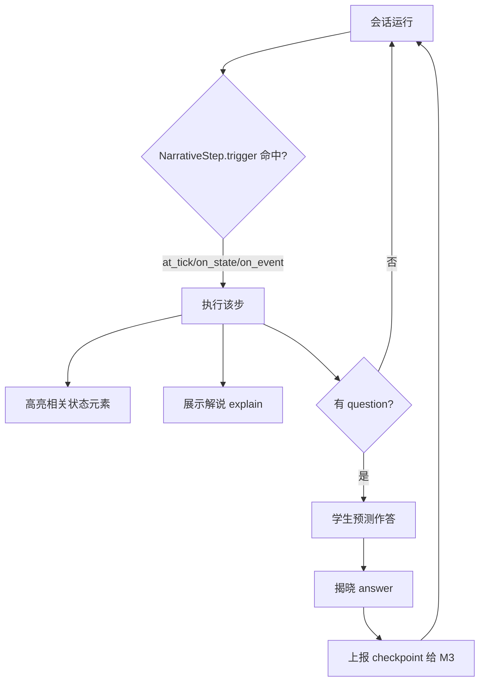
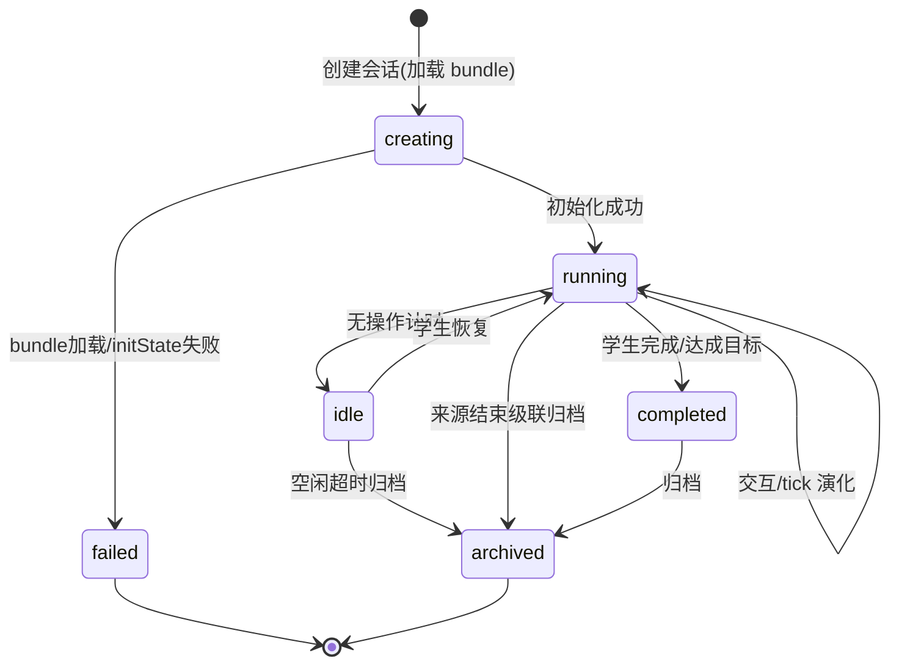
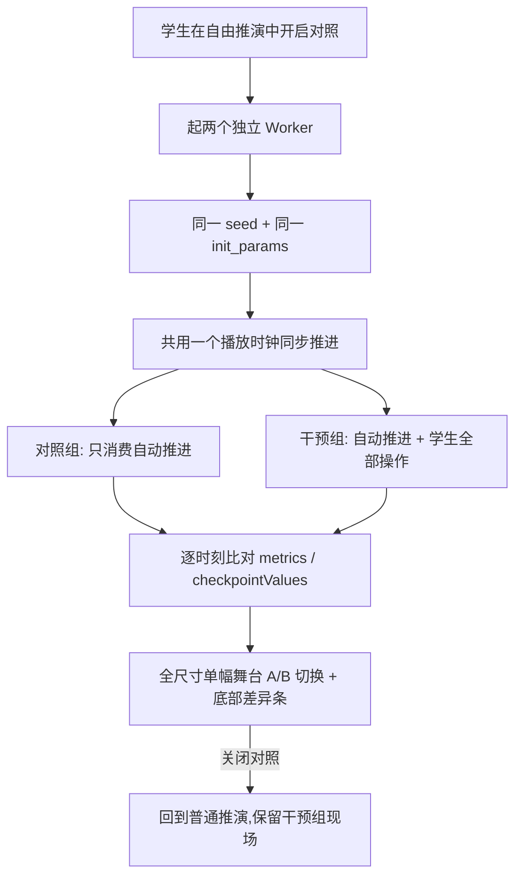

# M4 仿真可视化引擎 — 业务流程与状态机

> Mermaid 描述仿真会话、确定性回放、插件接入审核、教学叙事推进。
> 最后更新:2026-08-25

---

## 1. 仿真会话流程

执行位置按代码来源分流(见 07-架构设计.md §8),两条流程的差别只在「reducer 与 render 在哪跑」。

### 1.1 内置包(浏览器 Worker 运行)

```mermaid
flowchart TD
    A[调用方创建会话 package+seed+params] --> B[M4 登记 sim_session compute=browser]
    B --> C[前端按 code 在 Worker 内装配内置包内核]
    C --> D[initState(params, seed) 构造初始状态]
    D --> E[渲染初始画面 + 渲染交互控件]
    E --> F{tick 推进 / 学生交互}
    F -->|tick| G[reducer(state, tick事件)]
    F -->|交互| H[reducer(state, user事件)]
    G --> I[更新视图]
    H --> I
    H --> J[异步上报 sim_action_log]
    I --> F
    F -->|完成| K[会话归档]
```

### 1.2 扩展包与重计算仿真(隔离容器运行)



> 浏览器在这条流程里**不执行任何第三方代码**:容器返回的已是纯数据教学帧,
> 前端交给平台自己的封闭模式渲染器绘制(理由见 06-安全设计.md §2)。
> 操作序列由服务端在执行成功后登记,前端不重复上报同一动作。

---

## 2. 确定性回放流程

```mermaid
flowchart LR
    A[读取 session: seed + init_params] --> B[读取 sim_action_log 按 seq]
    B --> C[initState(params, seed)]
    C --> D[按 seq 重放每个 event]
    D --> E[逐 tick 重算状态]
    E --> F[复现与原会话完全一致的演化]
```

> 因 reducer 纯函数 + 种子化随机,重放结果必然一致。分享剧本同理。
> 重放位置与原会话一致:内置包在 Worker 内重放,扩展包在隔离容器内重放。

---

## 3. 单步回退(无需状态快照)



> 用"重算"替代旧版"快照栈",零存储成本。

两个执行位置同一口径:内置包在浏览器 Worker 内由 `SimEngine.back()` 丢掉最近一条事件后重放;
扩展包由服务端丢掉最近一条事件、经容器 `restore` 命令重放(客户端只发 `{"type":"back"}`)。
回退与「从头再来」之后本次连接不再登记新操作 —— 操作序列只追加,表达不了撤回。

**断线重连与刷新回到原位**:扩展包会话的过程由服务端持有(容器每次 exec 都是新进程),
连接建立时服务端取回本会话已登记操作、按 `at_tick` 摊平后交容器重放到上次位置,
不从 tick 0 重开 —— 否则刷新一次,操作记录里已有的步数就再也复现不出来(FE-9)。

---

## 4. 仿真包接入审核流程



预览 worker 领取时写入 `preview_lease_token/preview_lease_until` 并递增
`preview_attempt_count`;容器启动、装配或隔离设施异常只释放租约并等待下一轮重试,
不会把基础设施故障伪装成包内容退回。租约过期可被其他 worker 重领;达到
`ASYNC_OUTBOX_MAX_ATTEMPTS` 后写入固定的审核失败结论并清除租约,停止无限重试。

**审核与生产运行是同一套隔离设施**。「跑起来看效果对不对」这件事本身需要一个能安全执行第三方代码的地方,
那个地方就是隔离容器(06-安全设计.md §3)—— 不是先有运行时再补审核,而是审核所需的执行能力与生产运行时同构。

四项门禁与各自的生产者:

| 校验项 | 谁写入 | 何时 |
| --- | --- | --- |
| `metadata_validation` | 后端上传流程 | 提交时(表单与 `sim-package.json` 的 `meta` 逐字比对) |
| `static_scan` | 后端上传流程 | 提交时(危险调用模式扫描,结果供审核人参考,非隔离边界) |
| `determinism_check` | **M4 预览任务**(进程内后台任务) | 认领待审包后,容器内同 seed 同参数跑两遍逐帧比对 |
| `worker_preview` + `preview_frames` | **M4 预览任务**(进程内后台任务) | 同上,渲出样例教学帧并按 TeachingFrame 协议校验 |

预览任务与包同住 M4 进程,写自己的表不绕 HTTP 自调用,因此**没有回写接口** ——
一个能把两项门禁直接置为 `passed` 的服务签名入口本身就是审核闸门的旁路。

`approve` 要求四项全为 `passed` 且报告 `bundle_hash` 与 `sim_package.bundle_hash` 一致。
**后两项必须有真实生产者**:若只有门禁没有执行者,教师提交的包会永久停在待审、管理员点通过必然被 `41005` 拒,
而"退回给作者修改"对作者是无从下手的 —— 缺的两项不是作者能提供的东西。预览任务因此是审核链路的必要组成,
不是可选优化。

自动校验回答的是"能不能跑、是否确定性、帧是否合协议";它回答不了"这个 PBFT 实现对不对"。
故审核列表与作者预览都必须携带容器渲出的样例帧,把判断依据摊给人,而不是只给两个 `passed` 徽章。

- 命名空间前缀(`teacher_<id>__` / `org_<id>__`)防 code 冲突,由服务端按登录账号强制。
- `compute` 与执行能力由服务端按作者类型派生,作者不声明也不可选(见 07-架构设计.md §8)。

### 4.1 平台内置包不走审核流程(部署期入库)

上图只描述**外部提交**的包(教师 `teacher_<id>__`、第三方 `org_<id>__`)。平台内置标准库
(`builtin__`,7 类 41 个,见 08-可视化SDK与交互协议.md §8)是平台随版本交付的产物,没有"作者提交—平台审核"环节:

```
frontend/packages/sim-sdk/src/builtin/**/package.ts   (唯一真相源:TS 源码)
  → node scripts/codegen/export-sim-builtin-catalog.mjs  (导出为标准 sim-package.json 清单)
  → backend/internal/modules/sim/builtin_catalog.json     (go:embed 产物,入库)
  → migrate-and-seed → sim.SyncBuiltinPackages            (按 code+version 幂等 upsert,直接落已上架)
```

三条硬约束:

1. **清单必须由脚本导出,不得手写第二份**。内置包的 `interactions` 是操作上报的服务端校验白名单
   (02-数据模型.md §数据模型),手写清单会与前端声明漂移,漂移的后果是学生的合法操作被后端拒。
2. **入库前走与扩展包完全相同的 manifest 校验**(`parseBundleManifest`)。内置包不因"是平台自己的"
   而跳过协议校验;`compute` 必须为 `browser` —— 内置包是随版本交付的平台代码,在浏览器执行,
   而扩展包恒为 `isolated`,两者由 `author_type` 分流,不是同一维度上的可选项。
3. **从标准库移除的内置包置为已下架,不物理删除**。历史实验定义与仿真会话按 `(code, version)` 引用,
   删行会让旧实验取不到场景。`bundle_key` 用逻辑引用 `builtin://sim-sdk/{code}@{version}`,
   `bundle_hash` 取协议清单内容的 SHA-256(内置包无归档字节,用协议摘要表达版本完整性)。

内置包不进隔离容器,因此也不需要 `determinism_check`/`worker_preview` —— 它们随平台版本经
`pnpm build`、`sim-catalog-drift` 审查与 Go 侧清单测试把关,与后端 Go 代码同一发布链路。

改动内置包后必须重跑导出脚本并提交产物,CI 校验产物与源码一致(见 08-可视化SDK与交互协议.md §8.2)。


---

## 5. 教学叙事推进流程



---

## 6. 仿真会话状态机



- 操作序列持久化,归档后仍可回放/分享。
- `failed`:内置包装配或 `initState` 异常、或扩展包隔离容器装配/执行失败的失败态,前端展示错误并提示重试。
- `idle/archived`:学生中途离开,空闲超时归档;或来源(M7实验/M6课时)结束时经 `POST /sessions/recycle` 级联归档,避免会话永久 running 悬挂。
- 后端状态流转必须落库执行:`creating/running/idle/completed` 可进入 `archived`;`archived/failed` 为终态,不得被操作上报、检查点写入或重复回收重新修改。内部单会话操作按已验签 `source_ref` 校验来源归属,批量回收按 `scope_ref`,敏感生命周期动作写入 M1 统一 `audit_log`。
- `compute=isolated` 会话进入任一终态(`archived`/`failed`)时必须删除其隔离执行命名空间,并释放占用的租户并发额度;WS 断线视为 `idle`,超时后归档并回收 Pod,不留悬挂容器。

---

## 7. 对照推演流程(仅内置包 · 仅无会话自由推演)



- 两个会话各自持有自己的 events,**不共享状态**;差异只能由「有没有干预」解释,这是确定性带来的受控实验。
- 差异条只读协议已强制的扁平 `metrics` 与 `checkpointValues`,对任何包通用,不为单个包写专用对比视图。
- **只对内置包提供**:扩展包在隔离容器内运行,对照要两个会话即两个 Pod,成本翻倍而教学价值不变。
- **只在无会话自由推演里提供**:带会话时服务端记录是只追加的操作序列,表达不了对照组的推进,
  混入会与已有条目撞号 —— 与「回退即脱离记录」同一条道理。
- 多仿真同屏(不同包并排)明确不做,见 01 需求规格 §8。

---

## 8. 实验阶段编排流程

复杂实验需要分步骤推进(先理解共识 → 再学攻击 → 最后综合),且后续步骤需要前置结果(如攻击仿真需要知道共识的初始状态)。M7 实验支持多阶段配置,阶段间通过检查点结果传递参数,保持确定性;M4 仿真作为阶段的 `sim` 组件被引用(实验编排契约归属 M7 实验模块,存储模型见 `../07-实验/02-数据模型.md`,M4 仅经接口消费 `SimComponent.package_code`/`seed`/`params`)。

### 8.1 编排契约

M7 实验将仿真(M4 包 + 参数)作为阶段的 `sim` 组件引用。组合契约(环境/仿真/检查点组件、`stages` 阶段、`param_bindings` 参数绑定及其 `StageConfig`/`ParamBinding` 结构)由 M7 定义并持久化于 `experiment.components`(数据模型见 `../07-实验/02-数据模型.md` §2.1/§2.3,请求契约见 `../07-实验/03-接口设计.md` §2)。M4 仅经接口消费 `SimComponent.package_code`/`seed`/`params`,不参与组合 schema 的定义。

环境、仿真和检查点组件必须提交显式稳定 `id`;服务端不按数组顺序派生 ID。阶段、解锁条件和参数绑定只引用这些已声明 ID,所有字段名以 `snake_case` HTTP 契约为准。

### 8.2 确定性保证

- 参数绑定只在 **initState 时发生**,不是运行时注入;绑定的来源是 **检查点结果**(已持久化),可复现。
- 每个阶段独立记录 `seed + events`,回放建立在 §2 确定性回放之上:
  ```
  阶段1: initState(params1, seed1) → replay(events1) → checkpoint1Result
  阶段2: initState({...params2, injected: checkpoint1Result}, seed2) → replay(events2)
  ```
- 操作序列元数据包含参数来源,便于复现与审计:
  ```json
  {
    "session_id": "sess-stage2-xxx",
    "seed": 12345,
    "init_params": {
      "targetNodes": { "_source": "checkpoint:cp-understand-consensus:finalState.nodes", "_value": [...] }
    },
    "events": [...]
  }
  ```

### 8.3 阶段解锁与边界

- **解锁条件**:`checkpoint`(基于检查点得分,可设 `min_score`)/ `manual`。
- **允许**:检查点结果 → 后续阶段参数(initState 时)、阶段解锁(基于检查点得分)、常量参数注入。
- **禁止**:运行时跨阶段状态同步、阶段间实时通信、前置阶段的动态修改影响后续阶段。

### 8.4 教学价值

| 场景 | 传统方式 | 阶段编排 |
| --- | --- | --- |
| 复杂实验教学 | 一个巨型仿真,学生容易迷失 | 分步骤,循序渐进 |
| 前后关联 | 手动复制参数,易错 | 自动传递,无缝衔接 |
| 个性化路径 | 所有人走同一流程 | 根据检查点得分解锁不同难度 |

---

## 9. 代码追踪教学流程

学生看仿真动画,但常不理解"背后的代码怎么执行";抽象概念(如 require 检查、哈希计算)缺乏具象锚点。代码追踪在仿真执行时实时高亮对应代码行(类似 IDE 断点调试,但在教学仿真环境中),建立"可视化现象 ↔ 代码逻辑"的因果联系。

### 9.1 声明与渲染

- 仿真包可选声明 `codeTrace`(协议见 `08-可视化SDK与交互协议.md` §1.3):给出源代码、`lineMapping`(行号→状态条件)与 `variableWatch`(变量监视)。
- `reducer` 在返回状态中填充 `state._trace`(当前触发行、变量值);会话运行中,前端运行时自动读取 `state._trace`,在代码面板高亮 `triggeredLines`、展示 `variables`、按 `lineMapping` 显示教学注释。

### 9.2 设计边界

- 只允许**状态 → 代码行**的单向映射:高亮、变量监视、教学注释。
- **禁止**代码行 → 状态的反向修改(这不是调试器)、禁止断点/单步执行、禁止修改源码后重新执行。
- `codeTrace` 仅声明教学追踪配置;后端 `Package` 只持久化审核摘要(`CodeTraceAudit`),源码正文随 bundle 保存在对象存储(存储模型见 `02-数据模型.md`)。

### 9.3 教学价值

| 场景 | 传统方式 | 带代码追踪 |
| --- | --- | --- |
| 理解 PoW 挖矿 | 看动画,脑补"代码应该是..." | 看到 keccak256 那行高亮,nonce 实时变化 |
| 理解 require 检查 | 文字描述"校验失败会回退" | 看到代码行闪红,注释"难度检查失败" |
| 调试思维训练 | 无 | 类 IDE 体验,理解执行流 |
