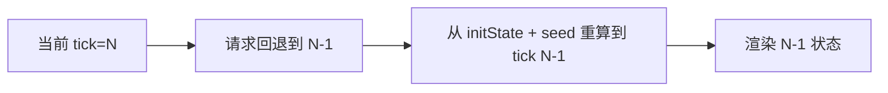
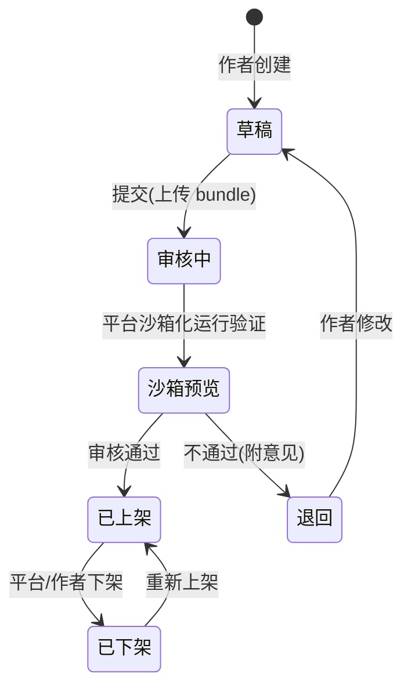
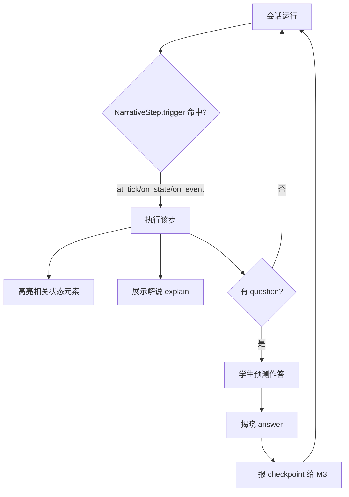
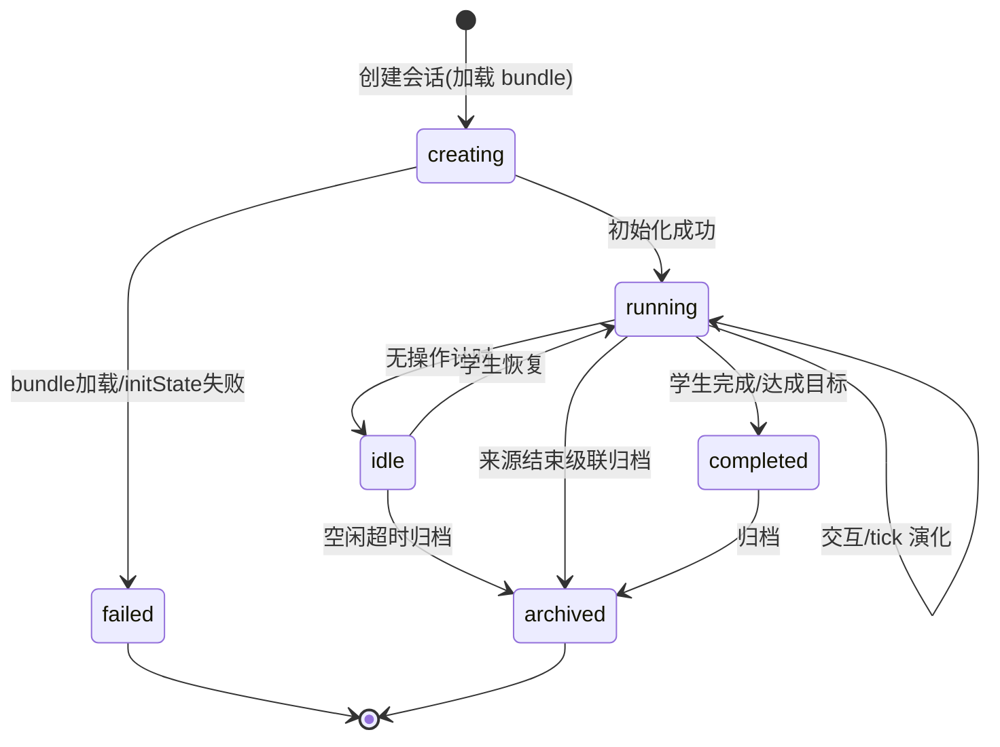
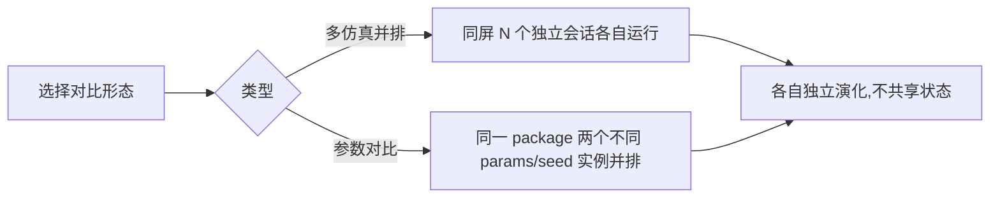

# M4 仿真可视化引擎 — 业务流程与状态机

> Mermaid 描述仿真会话、确定性回放、插件接入审核、教学叙事推进。
> 最后更新:2026-05-29

---

## 1. 仿真会话流程(前端运行)

```mermaid
flowchart TD
    A[调用方创建会话 package+seed+params] --> B[M4 登记 sim_session]
    B --> C[前端加载 bundle]
    C --> D[initState(params, seed) 构造初始状态]
    D --> E[渲染初始画面 + 渲染交互控件]
    E --> F{tick 推进 / 学生交互}
    F -->|tick| G[reducer(state, tick事件)]
    F -->|交互| H[reducer(state, user事件)]
    G --> I[更新视图]
    H --> I
    H --> J[异步上报 sim_action_log]
    I --> F
    F -->|完成| K[会话归档]
```

---

## 2. 确定性回放流程

```mermaid
flowchart LR
    A[读取 session: seed + init_params] --> B[读取 sim_action_log 按 seq]
    B --> C[initState(params, seed)]
    C --> D[按 seq 重放每个 event]
    D --> E[逐 tick 重算状态]
    E --> F[复现与原会话完全一致的演化]
```

> 因 reducer 纯函数 + 种子化随机,重放结果必然一致。分享剧本同理。

---

## 3. 单步回退(无需状态快照)



> 用"重算"替代旧版"快照栈",零存储成本。

---

## 4. 仿真包接入审核流程



- 审核必经**沙箱化预览**:在隔离环境运行仿真包,验证可运行、无恶意行为(见安全设计)。
- 命名空间前缀(`teacher_<id>__`)防 code 冲突。

---

## 5. 教学叙事推进流程



---

## 6. 仿真会话状态机



- 操作序列持久化,归档后仍可回放/分享。
- `failed`:bundle 加载或 initState 异常的失败态,前端展示错误并提示重试。
- `idle/archived`:学生中途离开,空闲超时归档;或来源(M7实验/M6课时)结束时经 `POST /sessions/recycle` 级联归档,避免会话永久 running 悬挂。

---

## 7. 并排对比流程

