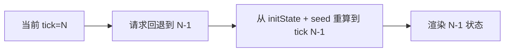
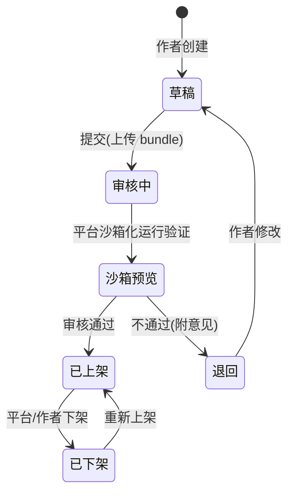
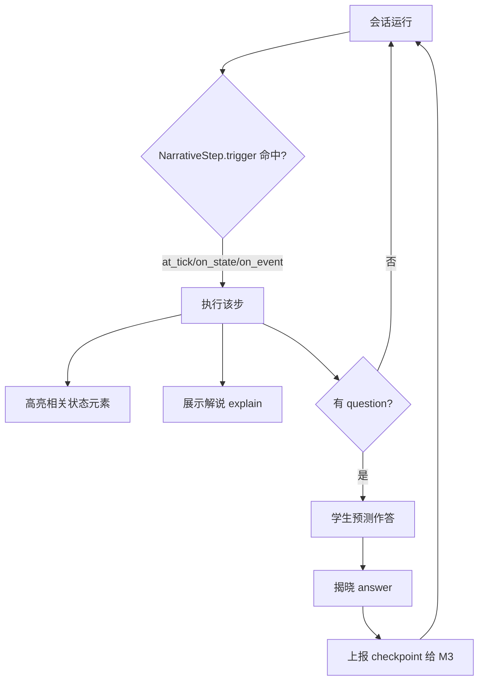
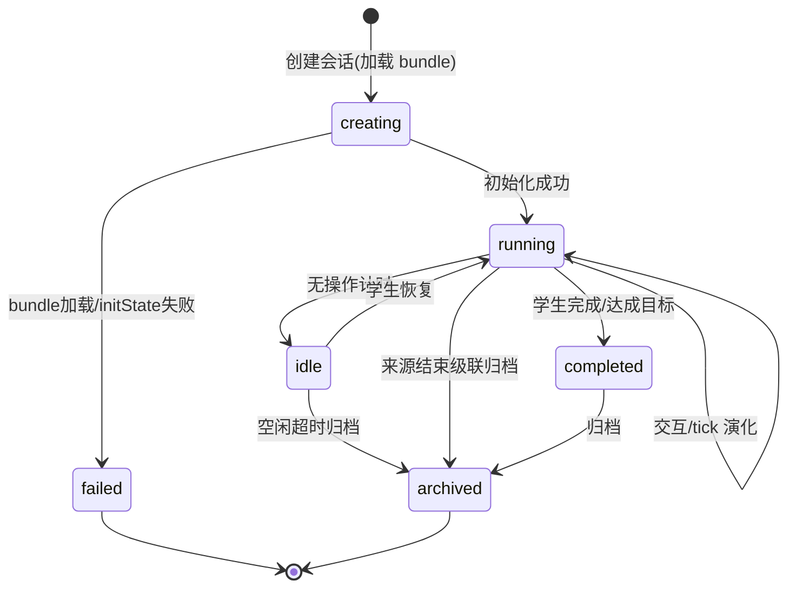
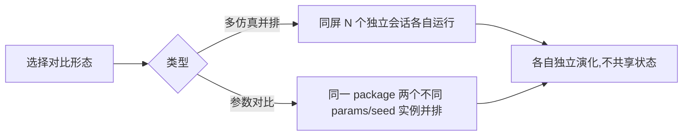

# M4 仿真可视化引擎 — 业务流程与状态机

> Mermaid 描述仿真会话、确定性回放、插件接入审核、教学叙事推进。
> 最后更新:2026-08-05

---

## 1. 仿真会话流程(前端运行)

```mermaid
flowchart TD
    A[调用方创建会话 package+seed+params] --> B[M4 登记 sim_session]
    B --> C[前端加载 bundle]
    C --> D[initState(params, seed) 构造初始状态]
    D --> E[渲染初始画面 + 渲染交互控件]
    E --> F{tick 推进 / 学生交互}
    F -->|tick| G[reducer(state, tick事件)]
    F -->|交互| H[reducer(state, user事件)]
    G --> I[更新视图]
    H --> I
    H --> J[异步上报 sim_action_log]
    I --> F
    F -->|完成| K[会话归档]
```

---

## 2. 确定性回放流程

```mermaid
flowchart LR
    A[读取 session: seed + init_params] --> B[读取 sim_action_log 按 seq]
    B --> C[initState(params, seed)]
    C --> D[按 seq 重放每个 event]
    D --> E[逐 tick 重算状态]
    E --> F[复现与原会话完全一致的演化]
```

> 因 reducer 纯函数 + 种子化随机,重放结果必然一致。分享剧本同理。

---

## 3. 单步回退(无需状态快照)


```mermaid
flowchart LR
    A[当前 tick=N] --> B[请求回退到 N-1]
    B --> C[从 initState + seed 重算到 tick N-1]
    C --> D[渲染 N-1 状态]
```

> 用"重算"替代旧版"快照栈",零存储成本。

---

## 4. 仿真包接入审核流程


```mermaid
stateDiagram-v2
    [*] --> 草稿: 作者创建
    草稿 --> 审核中: 提交(上传 bundle)
    审核中 --> 沙箱预览: 平台沙箱化运行验证
    沙箱预览 --> 已上架: 审核通过
    沙箱预览 --> 退回: 不通过(附意见)
    退回 --> 草稿: 作者修改
    已上架 --> 已下架: 平台/作者下架
    已下架 --> 已上架: 重新上架
```

- 审核必经**沙箱化预览**:在隔离环境运行仿真包,验证可运行、无恶意行为(见安全设计)。
- 命名空间前缀(`teacher_<id>__`)防 code 冲突。

### 4.1 平台内置包不走审核流程(部署期入库)

上图只描述**外部提交**的包(教师 `teacher_<id>__`、第三方 `org_<id>__`)。平台内置标准库
(`builtin__`,7 类 41 个,见 09 文档)是平台随版本交付的产物,没有"作者提交—平台审核"环节:

```
frontend/packages/sim-sdk/src/builtin/**/package.ts   (唯一真相源:TS 源码)
  → node scripts/codegen/export-sim-builtin-catalog.mjs  (导出为标准 sim-package.json 清单)
  → backend/internal/modules/sim/builtin_catalog.json     (go:embed 产物,入库)
  → migrate-and-seed → sim.SyncBuiltinPackages            (按 code+version 幂等 upsert,直接落已上架)
```

三条硬约束:

1. **清单必须由脚本导出,不得手写第二份**。内置包的 `interactions` 是操作上报的服务端校验白名单
   (04 文档 §数据模型),手写清单会与前端声明漂移,漂移的后果是学生的合法操作被后端拒。
2. **入库前走与扩展包完全相同的 manifest 校验**(`parseBundleManifest`)。内置包不因"是平台自己的"
   而跳过协议校验;`compute` 必须为 `frontend`(后端计算需要部署期装配的适配器编号,清单表达不了)。
3. **从标准库移除的内置包置为已下架,不物理删除**。历史实验定义与仿真会话按 `(code, version)` 引用,
   删行会让旧实验取不到场景。`bundle_key` 用逻辑引用 `builtin://sim-sdk/{code}@{version}`,
   `bundle_hash` 取协议清单内容的 SHA-256(内置包无归档字节,用协议摘要表达版本完整性)。

改动内置包后必须重跑导出脚本并提交产物,CI 校验产物与源码一致(见 09 文档 §2)。

---

## 5. 教学叙事推进流程


```mermaid
flowchart TD
    A[会话运行] --> B{NarrativeStep.trigger 命中?}
    B -->|at_tick/on_state/on_event| C[执行该步]
    C --> D[高亮相关状态元素]
    C --> E[展示解说 explain]
    C --> F{有 question?}
    F -->|是| G[学生预测作答]
    G --> H[揭晓 answer]
    H --> I[上报 checkpoint 给 M3]
    F -->|否| A
    I --> A
```

---

## 6. 仿真会话状态机


```mermaid
stateDiagram-v2
    [*] --> creating: 创建会话(加载 bundle)
    creating --> running: 初始化成功
    creating --> failed: bundle加载/initState失败
    running --> running: 交互/tick 演化
    running --> completed: 学生完成/达成目标
    running --> idle: 无操作计时
    idle --> running: 学生恢复
    idle --> archived: 空闲超时归档
    running --> archived: 来源结束级联归档
    completed --> archived: 归档
    failed --> [*]
    archived --> [*]
```

- 操作序列持久化,归档后仍可回放/分享。
- `failed`:bundle 加载或 initState 异常的失败态,前端展示错误并提示重试。
- `idle/archived`:学生中途离开,空闲超时归档;或来源(M7实验/M6课时)结束时经 `POST /sessions/recycle` 级联归档,避免会话永久 running 悬挂。
- 后端状态流转必须落库执行:`creating/running/idle/completed` 可进入 `archived`;`archived/failed` 为终态,不得被操作上报、检查点写入或重复回收重新修改。内部单会话回收和批量回收均按已验签 `source_ref` 校验来源归属,敏感生命周期动作写入 M1 统一 `audit_log`。

---

## 7. 并排对比流程


```mermaid
flowchart LR
    A[选择对比形态] --> B{类型}
    B -->|多仿真并排| C[同屏 N 个独立会话各自运行]
    B -->|参数对比| D[同一 package 两个不同 params/seed 实例并排]
    C --> E[各自独立演化,不共享状态]
    D --> E
```
