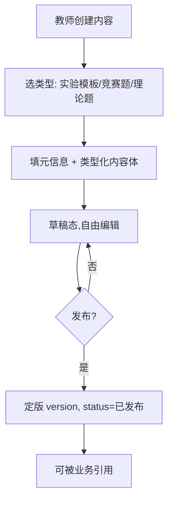
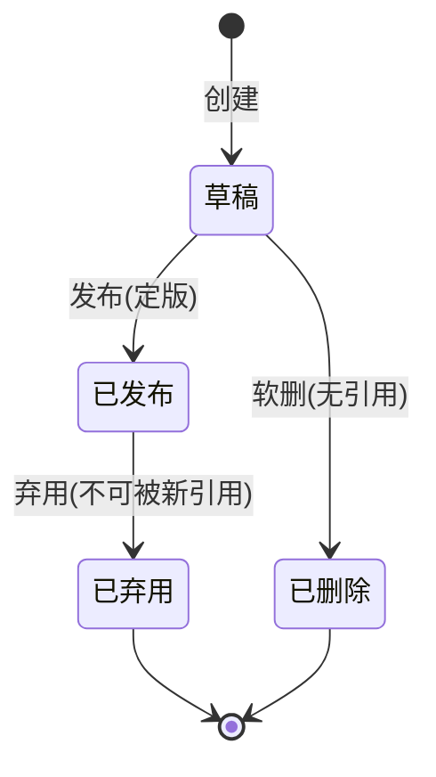
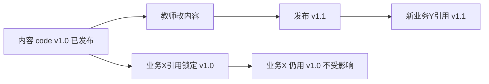
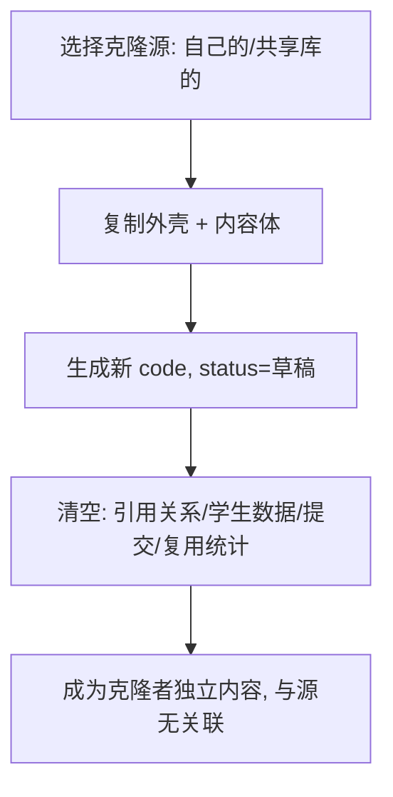
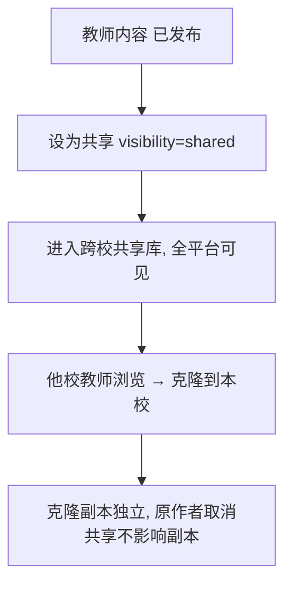
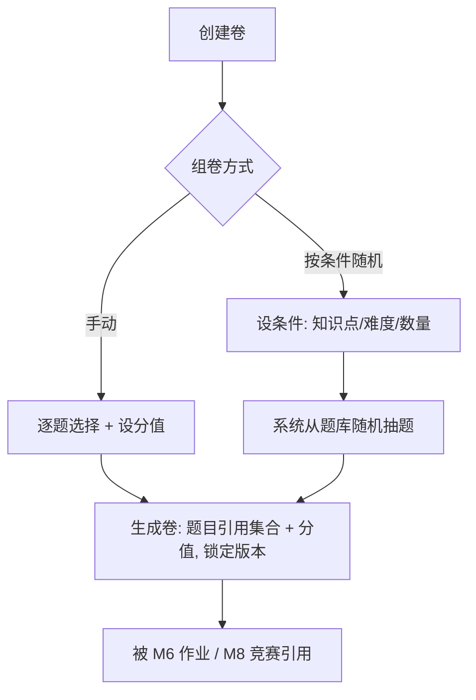
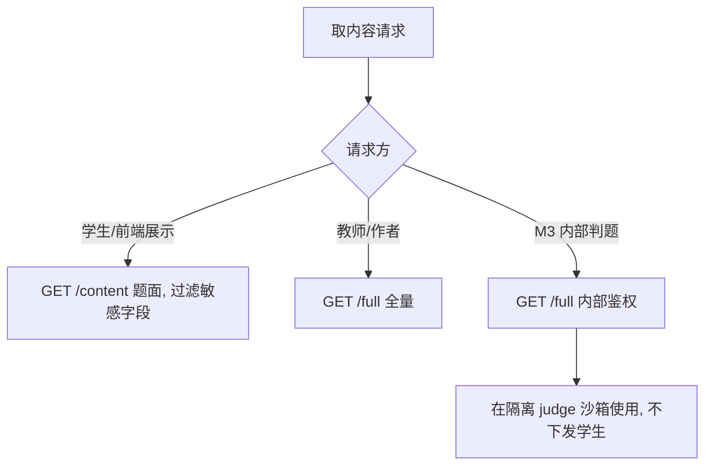

# M5 题库与模板中心 — 业务流程与状态机

> Mermaid 描述内容创作发布、版本演进、克隆共享、组卷、引用取用。
> 最后更新:2026-05-29

---

## 1. 内容创作与发布

---

## 2. 内容状态机

- 已发布版本内容**不可变**;改内容走"发新版本"。
- 有引用的内容不可删,只能弃用(旧引用仍指向该版本)。

---

## 3. 版本演进

> 引用锁版本保证旧实验/旧竞赛可复现稳定。

---

## 4. 克隆流程

---

## 5. 共享库流程

---

## 6. 组卷流程

---

## 7. 引用取用与权限分流

