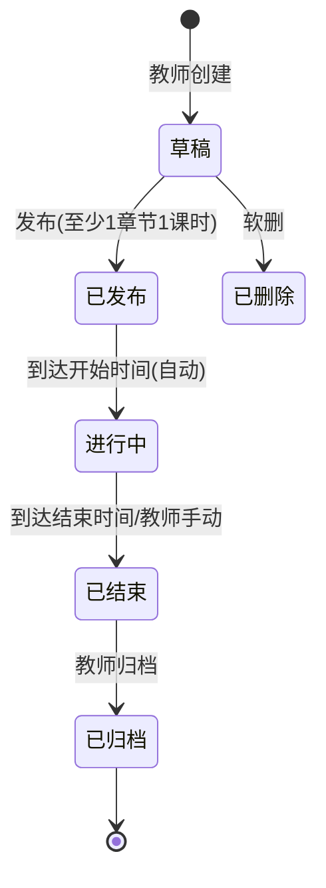
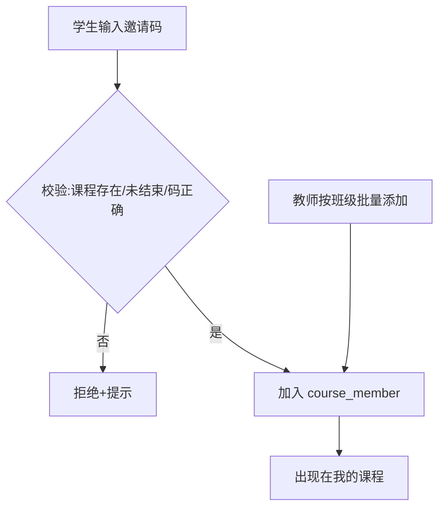
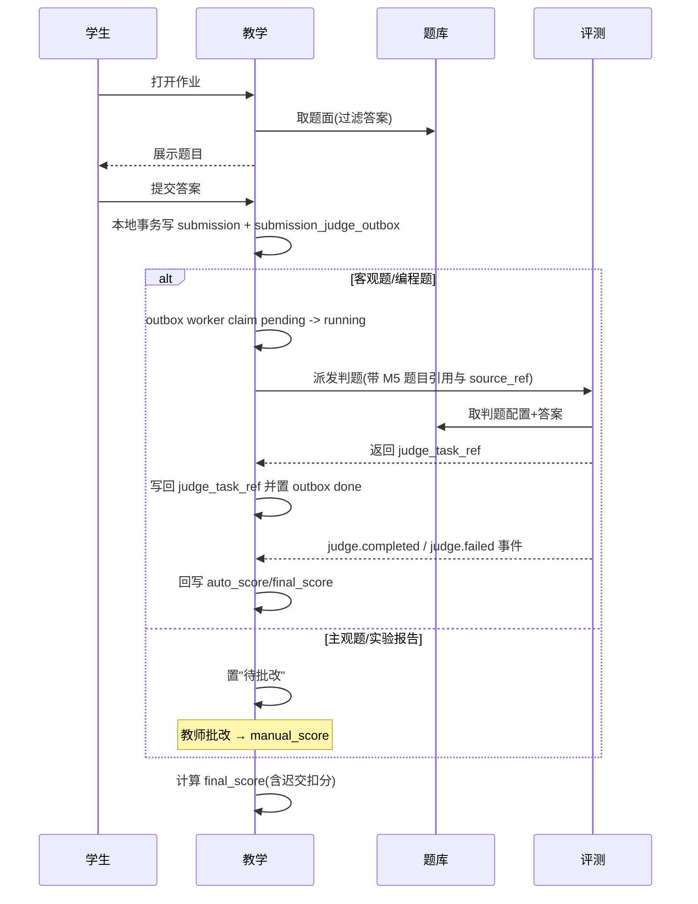
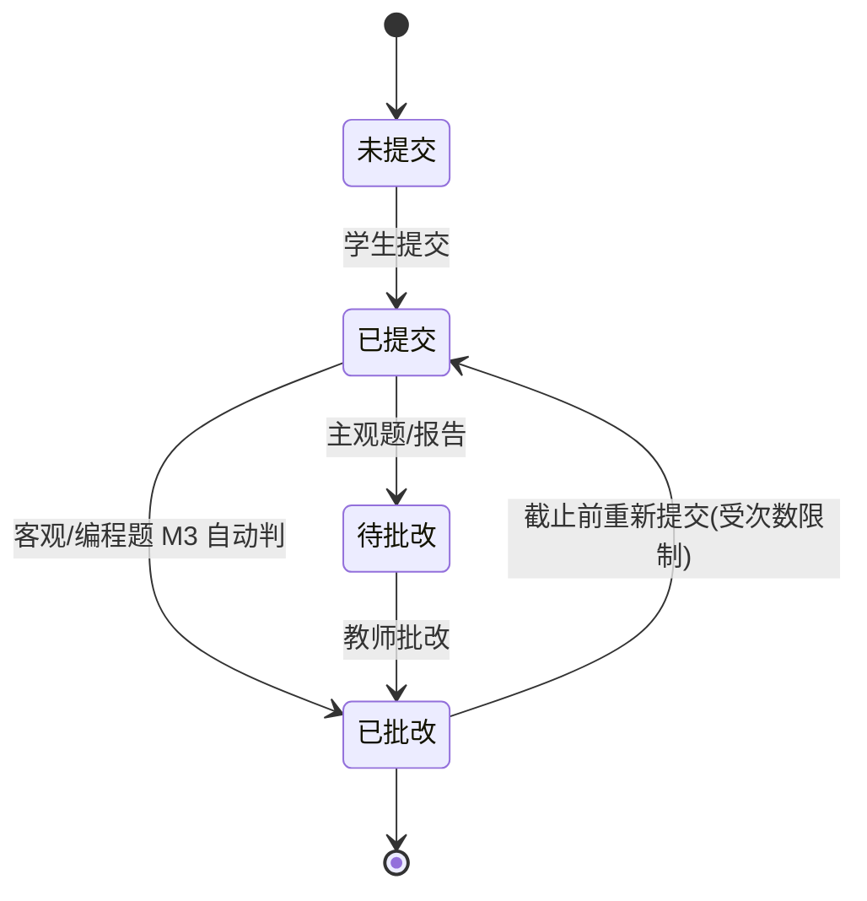
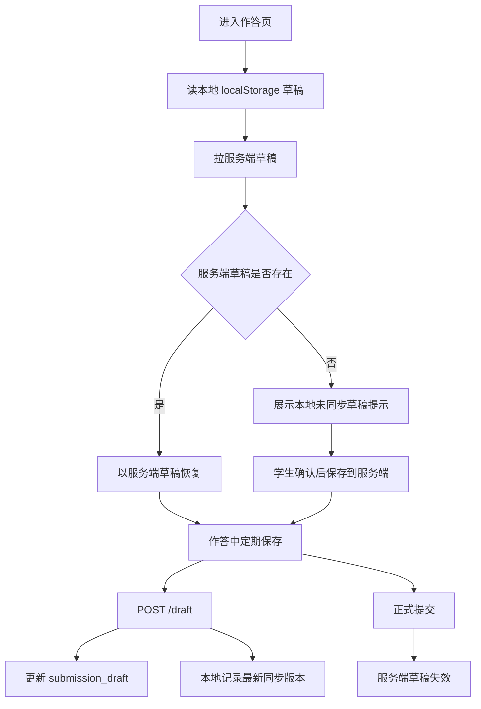
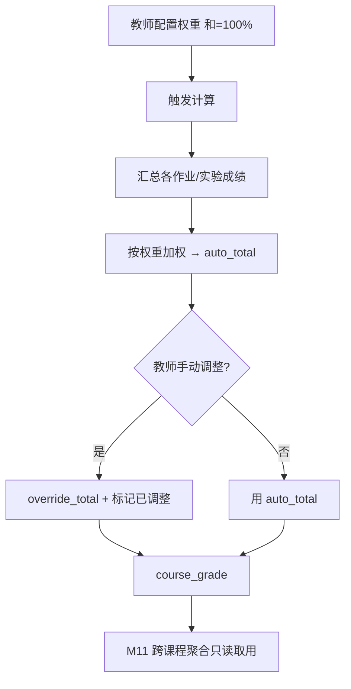
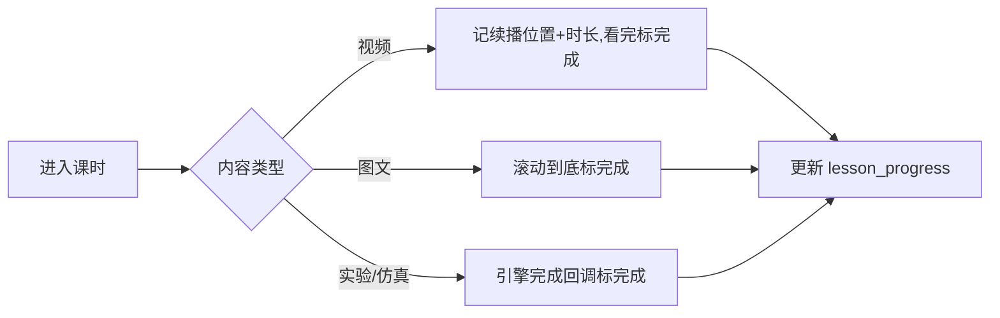

# M6 教学 — 业务流程与状态机

> Mermaid 描述课程生命周期、作业提交批改、学习进度、单课程成绩计算。
> 最后更新:2026-05-29

---

## 1. 课程状态机

- 已发布/进行中可编辑内容,但不能删已有提交的作业。
- 学生名单管理仅在已发布/进行中。
- 自动状态推进由 M6 后台任务完成,轮询间隔由 `TEACHING_COURSE_STATUS_POLL_INTERVAL_SECONDS` 配置,启动时必须为正数。

---

## 2. 学生加入课程

---

## 3. 作业提交与判题(跨模块协作)

> 自动判题派发使用 M6 本地 outbox。请求事务只写 M6 自有表,不直接调用 M3;outbox worker 将 pending 任务声明为 running 后派发。派发成功写回 `submission.judge_task_ref` 并将 outbox 置为 done;派发失败恢复 pending、递增重试次数并记录 `last_error` 供运维排查。M6 对一次提交内每道自动题生成一条 outbox,使用 `source_ref = teaching:<year>:submission:<id>:item:<assignment_item_id>`,M3 对 `tenant_id + source_ref` 幂等,保证 outbox 重试不会重复创建判题任务。M6 收到单题 `judge.completed` 后先回写该 outbox 的 `score/completed_at`,只有该提交全部自动题完成后才聚合写回 `submission.auto_score/final_score` 并发布 `teaching.grade.updated`。outbox 每轮批量和后台轮询间隔分别由 `TEACHING_JUDGE_OUTBOX_BATCH_SIZE`、`TEACHING_JUDGE_OUTBOX_POLL_INTERVAL_MS` 控制,启动时必须为正数。
---

## 4. 作业提交状态机

> 截止后提交标记迟交;按迟交策略处理。

---

## 5. 作答草稿

> 服务端 `submission_draft` 是作答草稿权威状态。本地 localStorage 只保存未同步编辑态和最近同步标记,不得在服务端保存失败或读取失败时直接替代服务端草稿进入提交链路;提交必须以服务端鉴权、作业状态和成员关系校验为准。

---

## 6. 单课程成绩计算

> 成绩导出必须使用真实 Excel 工作簿并分批读取 `course_grade`;导出分页批量由 `TEACHING_GRADE_EXPORT_BATCH_SIZE` 控制,启动时必须为正数,避免在模块代码中硬编码运行阈值。

---

## 7. 课时学习进度

