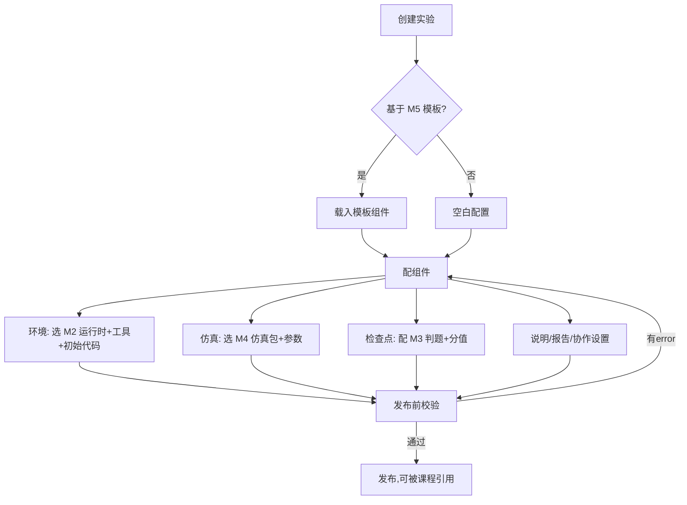
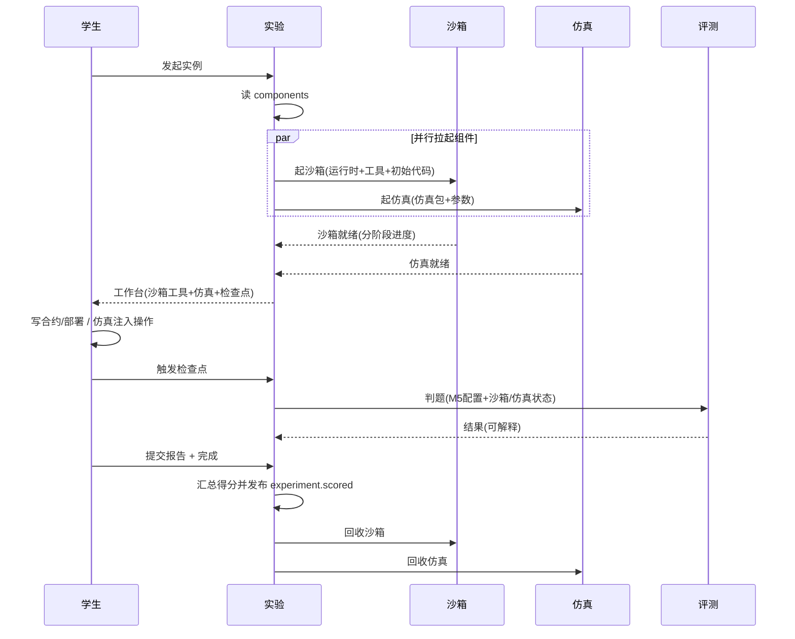
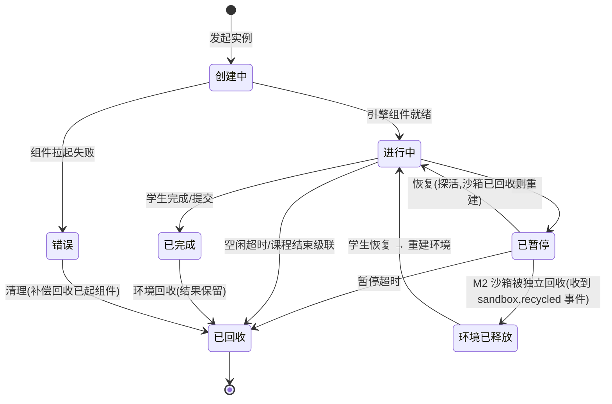
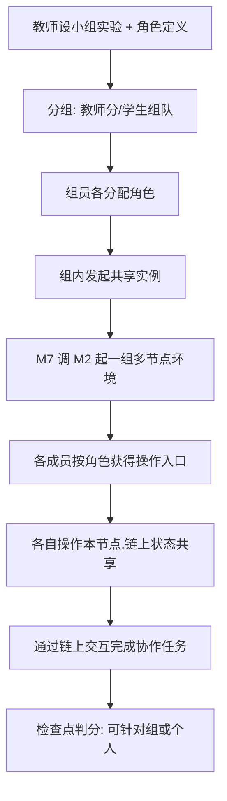
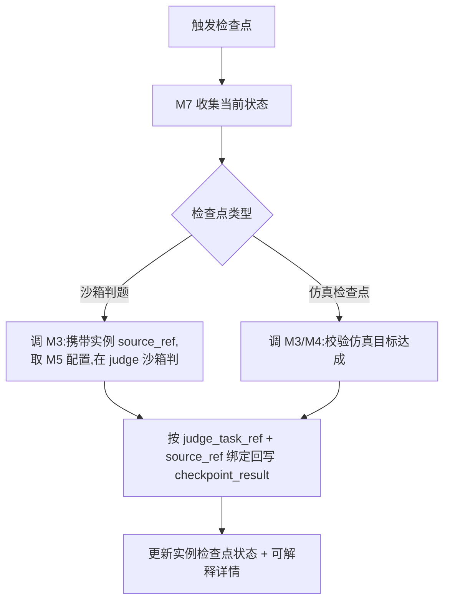
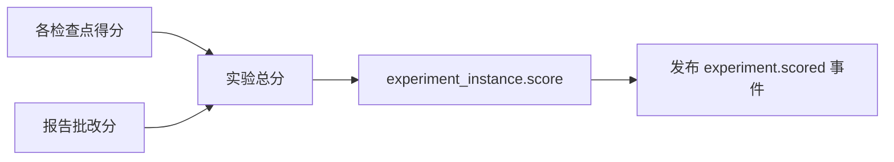

# M7 实验 — 业务流程与状态机

> Mermaid 描述实验配置发布、学生做实验编排、实例状态机、多人协作、检查点判分。
> 最后更新:2026-05-29

---

## 1. 教师配置实验(向导式)

---

## 2. 学生做实验编排流程

> 发布前校验先做结构、分值与 M5 锁定版本校验;M2 沙箱、M4 仿真、M3 判题器的运行可用性由创建实例和触发检查点时的引擎契约实时确认。实例创建时生成并持久化 `experiment_instance.source_ref`,M2/M4 创建、恢复重建、手动回收、错误补偿与 M3 检查点判题均使用同一 `source_ref`。若任一引擎创建失败,M7 将实例置为错误态并按该 `source_ref` 补偿回收已成功创建的组件。

---

## 3. 实验实例状态机

- 回收只释放引擎资源(M2/M4),实验结果(检查点/报告/得分)保留。
- **断点续做与生命周期同步**(A4 修复):M2 沙箱被独立回收时发布 `sandbox.recycled` 事件,experiment 订阅后将实例转"环境已释放"(逻辑态,持有代码持久化引用);学生恢复时 experiment 使用实例持久化 `source_ref` 重建环境(M2 拉回代码 + 重放部署脚本)再进入"进行中"。避免持失效 sandbox_ref 或跨年重算来源引用。用事件解耦,sandbox 不反向依赖 experiment(见工程目录设计 §3.1.1)。
- **暂停超时回收**:已暂停长时间不恢复则回收,防僵尸。
- **错误态补偿回收**(B7 修复):组件部分拉起失败(如 M2 成功但 M4 失败)时,错误态清理需**补偿回收已成功起的另一组件**(调 M2/M4 回收),不残留半截资源。

---

## 4. 多人协作流程

> 不做实时协同编辑;协作通过共享链状态实现。

---

## 5. 检查点判分流程

---

## 6. 得分汇总与事件发布

