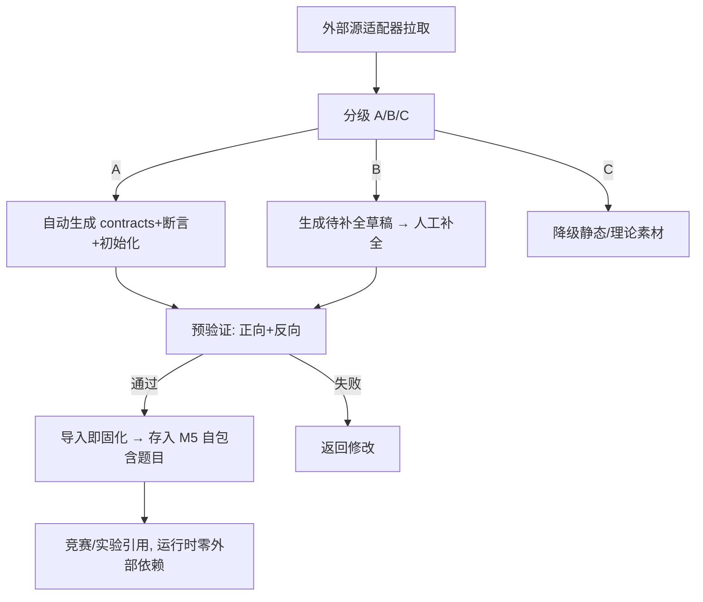

# M8 竞赛 — 专题设计:对抗赛撮合与真实漏洞源

> M8 两大技术核心:① 对抗赛异步撮合 + 天梯 + 回放;② 真实漏洞外部源接入与转化。
> 最后更新:2026-05-29

---

## 一、对抗赛异步撮合

### 1. 为什么异步

区块链对抗本质是**代码 vs 代码**(攻击脚本 vs 防御合约,策略合约 vs 策略合约),选手智慧固化在提交物里,无需实时操作。异步比实时在线对战复杂度低一个数量级,且天然支持回放。

### 2. 提交即参战 + 天梯撮合(创新)

```
选手提交参战物(防御合约/攻击脚本/策略合约)
   → 进入对战池
   → 撮合调度器持续两两撮合
   → 每局在 M2 干净沙箱执行 → 判定 → 更新天梯积分(ELO)
   → 选手可改进后重新提交,触发新对局
```

类似 AI 模型竞技场 / Codeforces 天梯,持续参与感强。

### 3. 两种对局规则(题目级配置,非赛制分类)

> 赛制只有"解题赛/对抗赛"两种。下面是对抗题的两种**对局规则**,由出题时 `contest_problem.battle_rule` 配置,决定该题对局如何进行。

**攻防型规则:**
```
守方提交防御合约(实现功能 + 无漏洞)
攻方提交攻击脚本
撮合:干净沙箱部署守方合约 → 跑攻方脚本 → M3 链上断言判定是否攻破
得分:攻破→攻方得分;挡住→守方得分
```

**博弈型规则:**
```
双方提交策略合约
撮合:沙箱部署双方合约 → 链上博弈多轮 → 按收益/胜负判定
得分:按对局结果给天梯积分
```

### 4. 撮合调度

| 模式 | 说明 |
| --- | --- |
| 循环赛 | 池中选手两两都打一遍,适合小规模赛 |
| 天梯(ELO) | 按积分就近匹配对手,适合大规模/持续赛 |
| 触发 | 新提交/改进提交触发与若干对手的新对局 |

- 撮合任务入队,worker 调 M2 起对局沙箱执行,异步回写结果。
- 对局确定性:固定沙箱镜像 + 固定初始状态,保证可复现可回放。

### 5. 对局回放(补旧版缺口)

```
每局完整记录:初始状态 + 双方提交物 + 链上每笔交易 + 判定结果
回放 = 在沙箱重放交易序列,前端逐步展示
```

- 选手赛后看回放:一步步看攻击怎么打、防御怎么破、博弈怎么输。
- 回放数据存储:记录交易序列(可重放),非全量状态快照(呼应 M2/M4 的可重建理念)。

---

## 二、真实漏洞外部源

### 1. 多源接入(可插拔适配器)

| 源 | 内容 | 典型用途 |
| --- | --- | --- |
| SWC Registry | 标准合约弱点分类 + 示例代码 | 自动生成 isolated 草稿题 |
| 公开漏洞情报(Rekt/SlowMist 等) | 真实安全事件元数据/源码/PoC | A/B 级链上题 |
| CVE / 链上事件 | 有链上记录的真实攻击 | forked 复现题 |

新增源 = 增加一条 `vuln_source.config` 配置,不改平台代码(呼应平台插件化)。M8 后端按配置驱动的通用源适配器执行同步,把外部案例拉取为 `vuln_problem` 草稿;预验证通过后仍由 finalize 调 M5 `system-import` 固化为自包含题目。

`vuln_source.config` 结构:
```json
{
  "endpoint": "https://example.edu/api/vulnerabilities",
  "method": "GET",
  "timeout_seconds": 10,
  "headers": {
    "Authorization": "Bearer <token>"
  },
  "body": {},
  "cases_path": "items",
  "mapping": {
    "external_ref": "id",
    "title": "title",
    "level": "level",
    "runtime_mode": "runtime_mode",
    "draft_body": "body"
  }
}
```

- `endpoint` 仅允许 `http/https`,生产配置由出题教师或管理员维护;密钥类字段保存前加密。
- `method` 仅允许 `GET/POST`;`timeout_seconds` 取 1-60 秒,省略时使用环境变量 `CONTEST_VULN_SOURCE_TIMEOUT_SECONDS`,禁止代码内硬编码兜底。
- `cases_path` 为空表示响应根就是案例数组;非空时按点路径从 JSON 对象中取案例数组。
- `mapping` 把外部字段映射为 M8 草稿字段;`level` 支持 `1/2/3` 或 `A/B/C`,缺省用 `vuln_source.default_level`;`runtime_mode` 支持 `1/2` 或 `isolated/forked`,缺省为 `isolated`。
- 同步只生成 M8 漏洞题草稿,答题运行时不直接依赖外部源。

### 2. 可复现性分级(沿用旧版 A/B/C)

| 级别 | 具备 | 处理 |
| --- | --- | --- |
| A 级 | 源码 + 初始化 + PoC + 可判定结果 | 自动转链上验证题 |
| B 级 | 源码 + 部分攻击路径,缺完整验证 | 生成待补全草稿,人工补全 |
| C 级 | 仅文章/报告/分类 | 降级为静态/理论题素材,不自动生成链上题 |

### 3. 两种运行时

| 模式 | 说明 | 适用 |
| --- | --- | --- |
| isolated | 平台起干净测试链复现 | 可本地重建的漏洞、模板题、教学题 |
| forked | 从真实链指定历史区块派生临时链 | 依赖历史链状态的真实 DeFi/协议漏洞 |

### 4. 导入即固化(关键健壮性,解决"获取不到就废")

```
外部源数据导入
   → 完整快照落库到 M5 题目:
       合约源码 + bytecode + 初始化交易 + 验证断言
       + (forked) 锁定历史区块号 + 缓存所需链上状态快照
   → 题目从此自包含
   → 运行时 / 学生答题完全不依赖外部源在线
```

- 外部源挂了/改了/删了,**已入库题目照常可用可答**。
- 外部源仅在**出题阶段**在线使用(同步情报、拉案例);答题运行时零外部依赖。
- forked 题锁区块 + 缓存状态,不依赖外部 RPC 实时可用。

### 5. 预验证(沿用旧版 6 步,保证可解可判)

```
Step1 部署测试环境(isolated 起临时链 / forked 派生 Fork 链)+ 执行初始化
Step2 出题者/系统提交官方 PoC
Step3 正向验证:执行 PoC → 所有断言通过 = 漏洞确实可利用
Step4 反向验证:干净环境不执行 PoC → 所有断言失败 = 不会误判
Step5 双向通过 → 题目可提交审核入 M5
Step6 失败 → 返回详情,修改后重验
```

- 任何来源的题入库前必过预验证,杜绝"导进来却没法答"的废题。
- 断言类型(沿用旧版 7 种):余额/代币余额/存储槽/owner/事件/代码/自定义脚本检查。

### 6. 转化流水线总览


