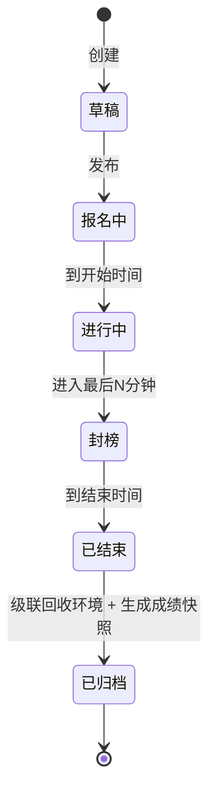
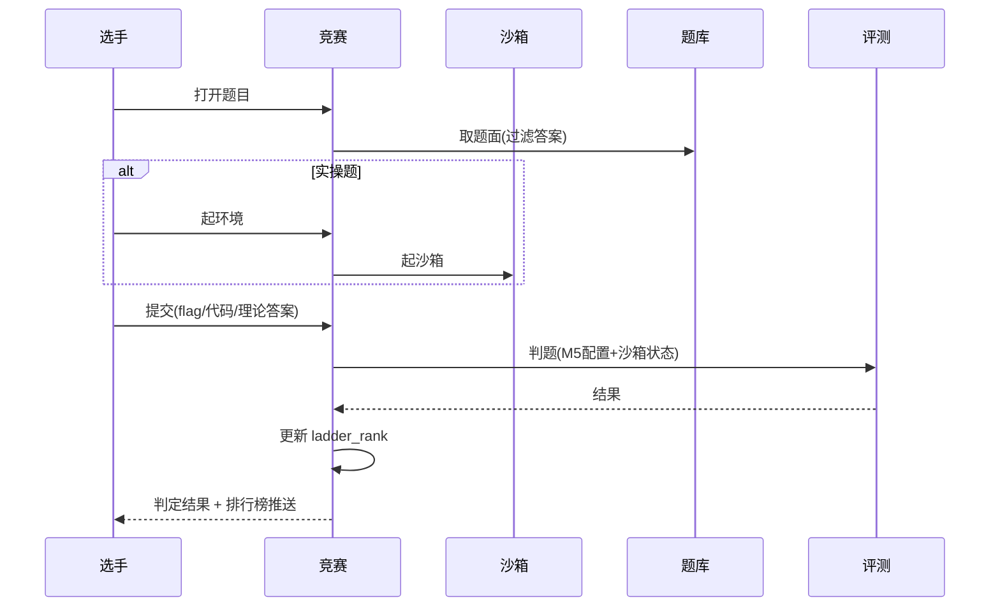
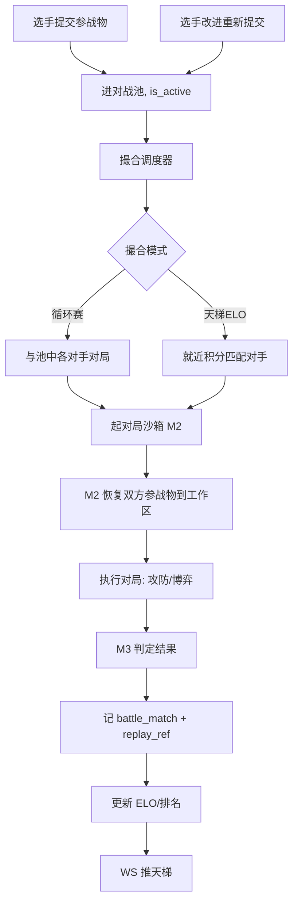
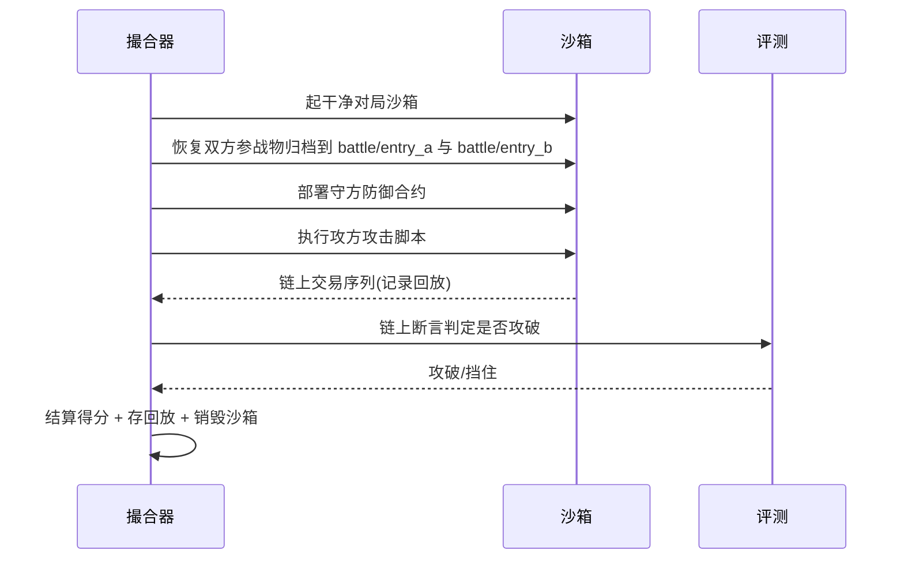
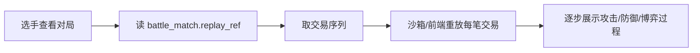
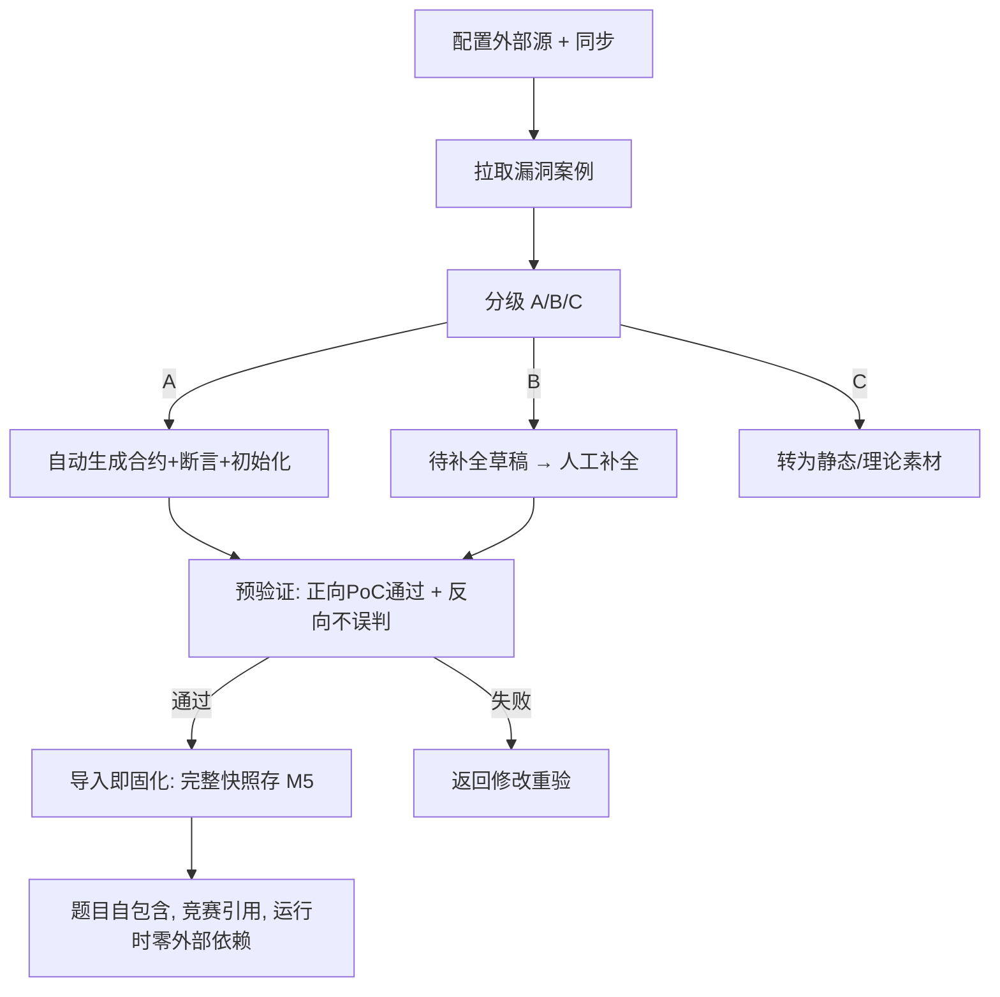
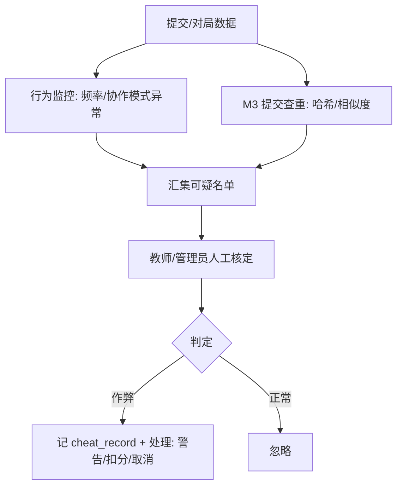

# M8 竞赛 — 业务流程与状态机

> Mermaid 描述竞赛生命周期、解题流程、对抗撮合、回放、漏洞转化。
> 最后更新:2026-05-29

---

## 1. 竞赛状态机



- 封榜期:排行榜冻结显示,提交仍判定但排名不实时公开。
- **已结束 → 已归档**(A5 修复):竞赛结束时执行收尾——① 调 `POST /sandboxes/recycle(source_ref=contest:{id})` 级联回收所有解题赛环境与对抗对局沙箱(与 M7 对齐"三重回收"承诺);② 生成竞赛成绩快照存档(B11 个人战绩档案)。

---

## 2. 报名组队

```mermaid
flowchart TD
    A[学生报名] --> B{个人/团队}
    B -->|个人| C[创建单人队]
    B -->|团队| D[创建队伍+邀请码]
    D --> E[队员加入(可跨校,需平台用户)]
    C --> F[开赛自动锁定]
    E --> F
```

---

## 3. 解题赛流程



---

## 4. 对抗赛撮合流程



---

## 5. 对抗对局执行(攻防类)



---

## 6. 对局回放



---

## 7. 真实漏洞转化流程



---

## 8. 防作弊判定


