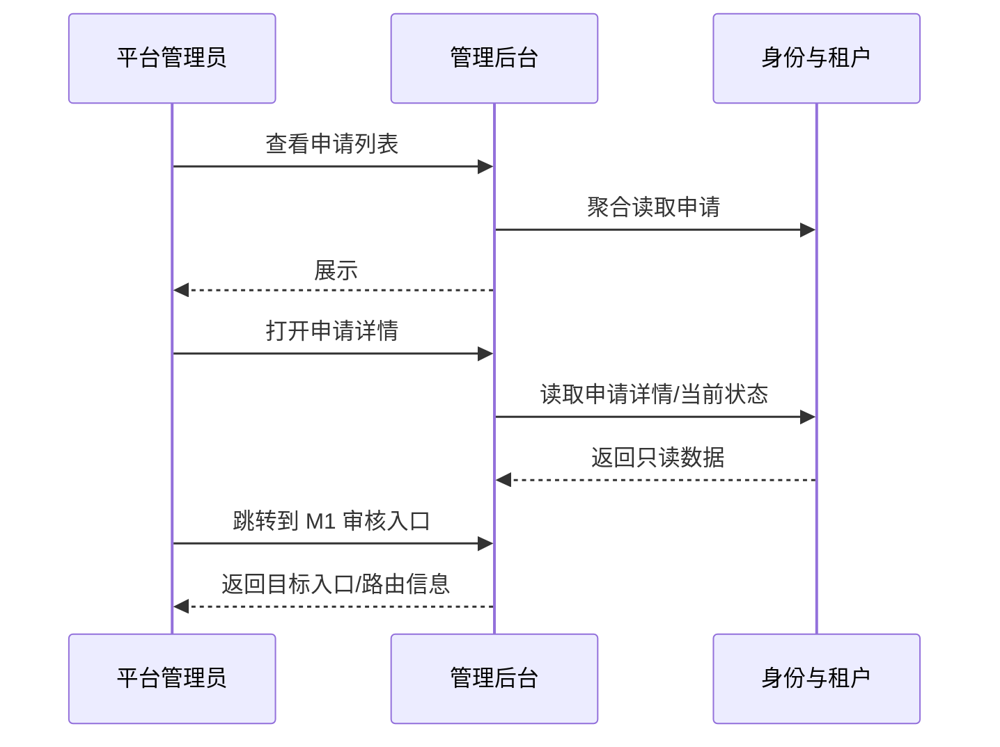
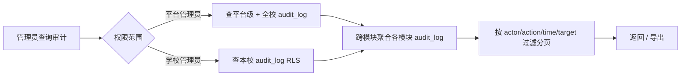
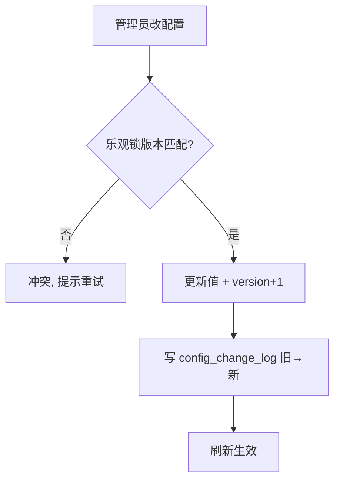
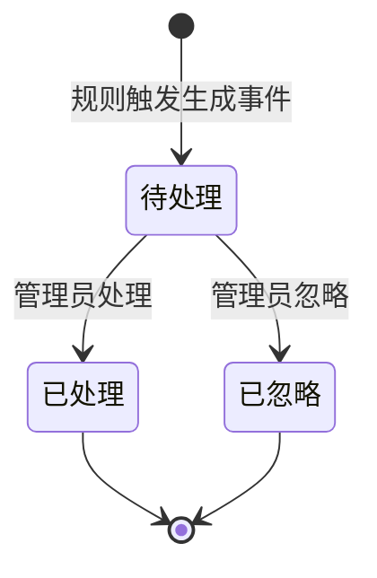
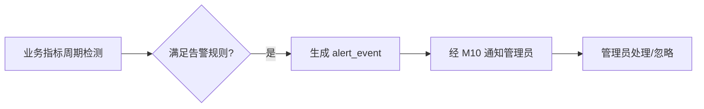
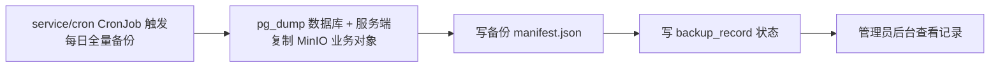

# M9 管理后台 — 业务流程与状态机

> Mermaid 描述看板聚合、审计查询、配置变更、告警处理、备份。
> 最后更新:2026-05-29

---

## 1. 看板聚合(只读不跨写)

```mermaid
flowchart TD
    A[管理员打开看板] --> B[M9 聚合查询调度]
    B --> C1[M1: 用户/租户数]
    B --> C2[M6: 课程/学习数据]
    B --> C3[M7: 实验活跃]
    B --> C4[M8: 竞赛数据]
    B --> C5[M2: 资源用量]
    C1 & C2 & C3 & C4 & C5 --> D[合并 + 统计快照加速]
    D --> E[返回看板]
    Note over B,E: 全程只读,不写任何业务模块
```

---

## 2. 学校入驻审核视图(M9 只读展示,M1 执行业务命令)



> 审核通过、驳回、创建租户、开通学校管理员账号都由 M1 自有接口完成。M9 只提供只读视图、筛选检索与入口跳转,不承接跨模块业务命令,也不转发写请求。

---

## 3. 统一审计查询



---

## 4. 配置变更(乐观锁 + 留痕)



---

## 5. 告警处理





> 基础设施告警来自外接 Prometheus/Grafana;M9 只管业务级告警(待审积压/配额超限等)。

---

## 6. 备份记录



> M9 记录备份状态;实际备份执行由受控 `service/cron` CronJob 完成。`backup_record.storage_ref` 指向备份清单对象,HTTP API 不暴露对象引用和下载直链。
