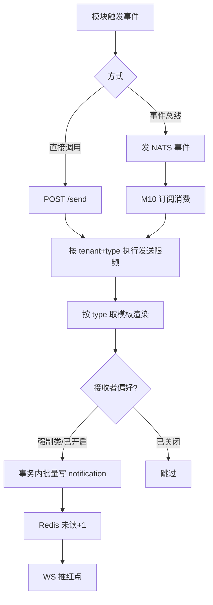
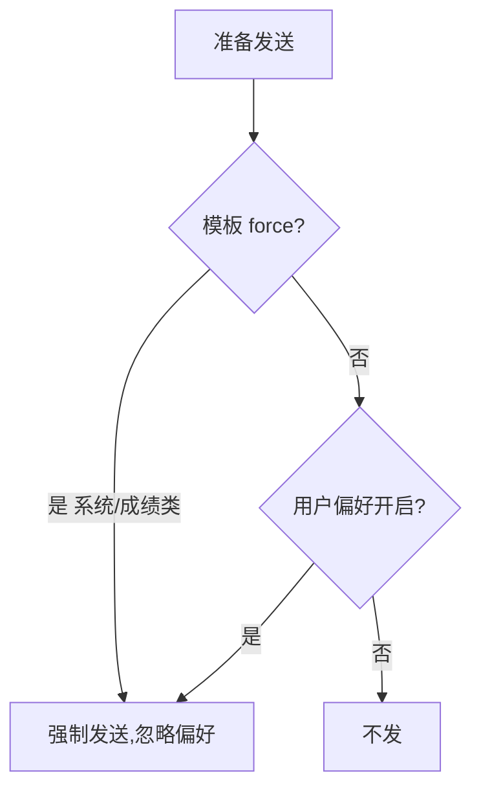

# M10 通知与实时推送 — 业务流程与状态机

> Mermaid 描述通知发送、公告下发、实时推送、事件总线解耦。
> 最后更新:2026-05-29

---

## 1. 统一通知发送



> 未读红点以 `notification.is_read` 为权威状态;Redis 仅作实时缓存。缓存 miss 或键过期时,M10 必须按站内信表重建未读数后再返回。
> 单次 `Send` 对未被偏好过滤的全部接收者必须原子写入站内信;任一接收者写库失败则整次发送失败且不留下部分通知。Redis 未读和 WebSocket 红点是站内信写入后的实时加速/提示,失败只记录日志并由收件箱与未读重建承担一致性。
> 发送限频按 `tenant_id + type` 计数,窗口长度和窗口内最大次数由 `NOTIFY_SEND_RATE_WINDOW_SECONDS`、`NOTIFY_SEND_RATE_MAX` 控制;超限时必须返回 `A0010` 并拒绝写入站内信。
> 事件总线入口只消费 `notify.send.requested` 和 `notify.push.requested`,载荷必须带真实 `tenant_id` 与 `trace_id`;失败由统一 eventbus 重试/DLQ 处理。

---

## 2. 系统公告下发(不写放大)


> 全校公告只存一条,不为每人复制,避免写放大。
> 租户级公告发布成功后只发实时刷新提示,不复制为个人站内信;平台级公告不在 M10 内枚举全平台租户广播。

---

## 3. 实时推送(WebSocket Hub)

```mermaid
sequenceDiagram
    participant C as 客户端
    participant Hub as M10 Hub
    participant Mod as 业务模块
    C->>Hub: WS 连接(JWT 鉴权)
    C->>Hub: subscribe(tenant:{tenant_id}:...)
    Mod->>Hub: POST /push(tenant_id, topic, payload)
    Hub->>C: 推送给订阅该 topic 的在线连接
    Note over C,Hub: 心跳保活;断线重连;单端被踢则关闭
```

---

## 4. 事件总线解耦

```mermaid
flowchart LR
    A[模块产生事件] --> B[发 NATS 事件即返回]
    B --> C[M10 消费]
    C --> D{投递成功?}
    D -->|是| E[转站内信 / 实时推送]
    D -->|否| F[重试 N 次]
    F -->|仍失败| G[进死信队列 DLQ + 告警]
    Note over A,B: 发送方不阻塞,与投递解耦
```

> **投递可靠性(C3 修复)**:M10 消费事件失败按指数退避重试;重试耗尽进**死信队列(DLQ)**并触发运维告警人工介入。强制类通知(系统/成绩/审核)保证至少一次投递;站内信落库是权威记录,实时推送只承担在线提示。

---

## 5. 通知偏好与强制规则


