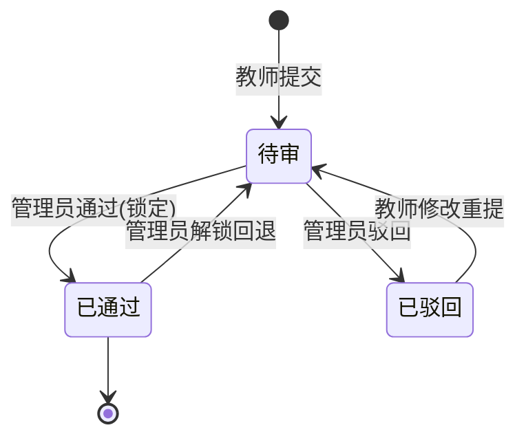
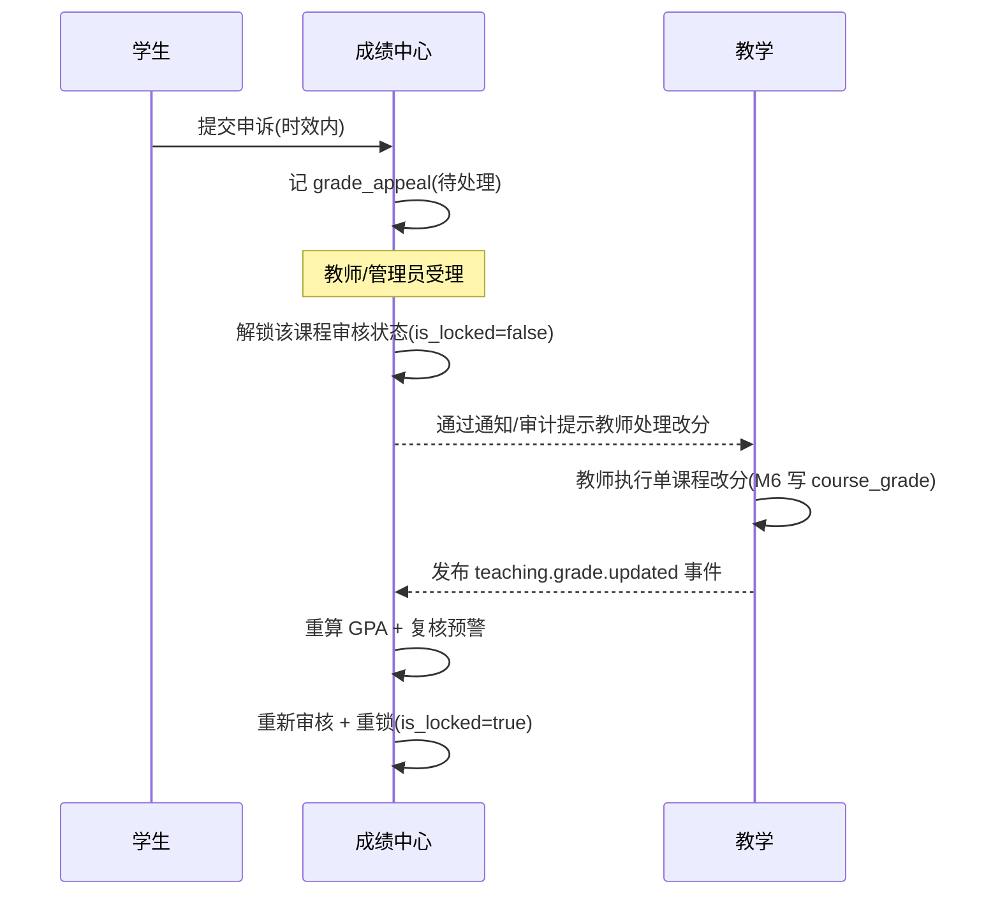
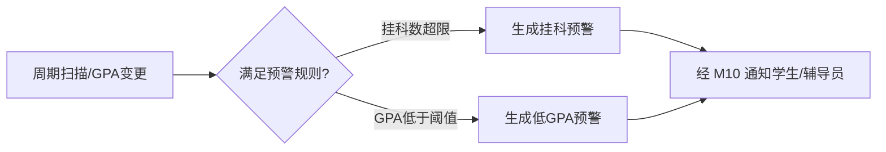
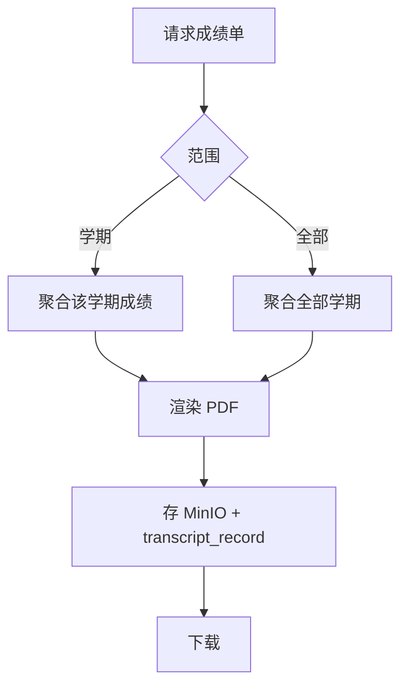
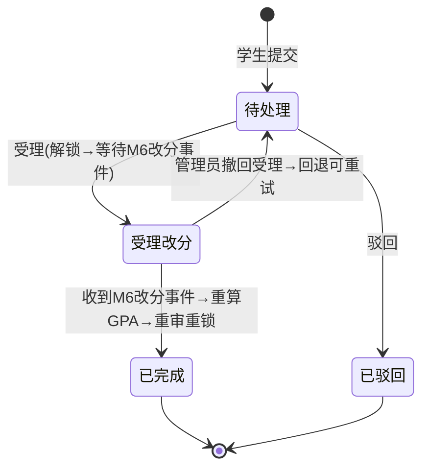

# M11 成绩中心 — 业务流程与状态机

> Mermaid 描述成绩审核、GPA 聚合、申诉改分、学业预警、成绩单。
> 最后更新:2026-05-29

---

## 1. 成绩审核工作流



---

## 2. GPA 聚合(只读 M6)

```mermaid
flowchart TD
    A[课程成绩审核通过] --> B[M11 读 M6 课程成绩+学分]
    B --> C[按 grade_level_config 映射绩点]
    C --> D[Σ绩点×学分 / Σ学分]
    D --> E[更新 student_semester_grade]
    E --> F[累计 GPA 重算]
    F --> G[触发学业预警扫描]
    Note over B: 只读 M6,不写 M6
```

---

## 3. 申诉改分(跨模块,经解锁→M6 改分事件→重审→重锁完整回路)



> **A6/C4 修复**:已锁定成绩不被旁路修改。申诉受理走完整回路:解锁 M11 审核状态 → M6 教师成绩入口改分 → M6 发布成绩变更事件 → M11 重算 GPA → 重审重锁。M11 仅保存自有聚合与审核状态,单课程成绩修改归属 M6。

---

## 4. 学业预警



---

## 5. 成绩单生成



---

## 6. 申诉状态机


